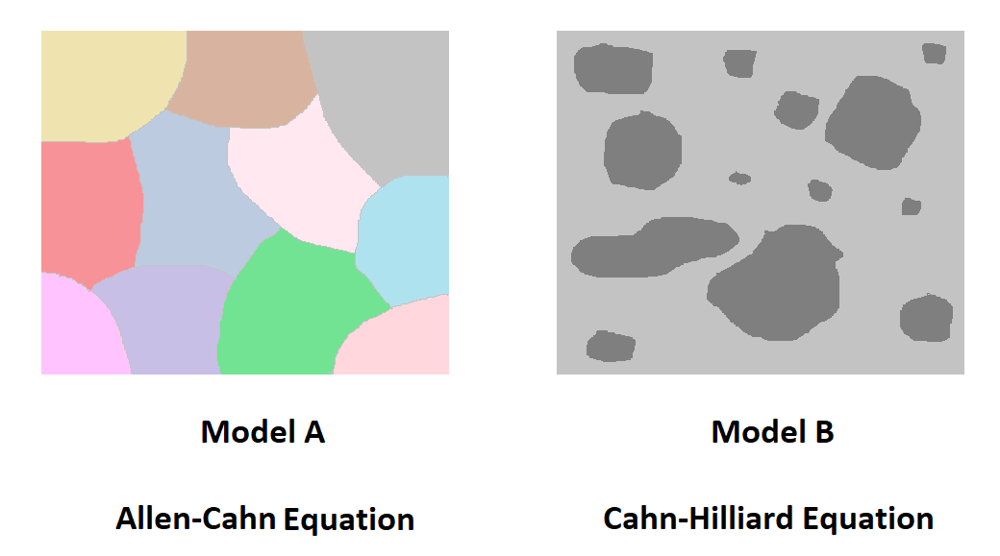

# Programming-Phase-field-in-Fortran

The repository shows the use of Fortran programming language for the phase-field methods &mdash; model A, model B, and model C. The codes are 2D. Model A ( Allen-Cahn equation ), and Model B ( Cahn-Hilliard ) examples are given; solidification of a single component alloy is also provided.

___
## **Significance** 

 *  **Sequential code**.

 * Self-explanatory  **comments** for each section.

 *  **Stand-alone** codes.

 * Code description in  **README** files.

 *  **Examples:** FeCr alloy for model B; grain evolution for model A. 

 * Some of the  **best programming practices** .

      * *if statement* rather than *if then* construct

 * Demonstration of  **concurrent programming technique** .

      * Model B example

 * File savings with  **logical unit number**.

      * Model A example

 *  **Screen shots** for each output code.

 *  **Data availability** for each code.

 *  **Compiler comparison**  for further studies.

      * Model B README

 * Instructions for  **different operating systems**.

 *  **Optimization**  options.

 * Integrated  **dislin graphical software** in each code:

    * Single statement  **quick plots**.

    * Routines for  **continuous animation**. 

    *  **Multiplot** techniques.

 *  **gnuplot script** for output files:
    * Customized  **color plots**.

    * commands for  **continuous animation**. 

    *  **Multiplot** approach.

## **Computational Tools**

The simulations were performed on the system with the following details:

|                OS      |      Compilers and versions               |  Integrated graphics library  |  Output graphics library   |
| -----------------------| ----------------------------------------- |------------------------------ |----------------------------|
| Linux (ubuntu 20.04)   |     gfortran (12.1.0)                     |  Dislin ( 11.5 )              |     gnuplot ( 5.4 )        |
| Windows (10, 64 bit)   |     gfortran (12.1.0), intel (2021.6.0)   |  Dislin ( 11.5 )              |     gnuplot ( 5.4 )        |

## **Future work**

* [Whole array programming](https://github.com/Shahid718/Phase-field-Fortran-codes-using-whole-array)
  
*  Procedural programming

      * [internal procedures](https://github.com/Shahid718/Fortran-Phase-field-codes-using-Internal-Procedures)
      * external procedures
               
* Modular programming

* Object-oriented programming

* Parallel programming with 

  * Co-arrays
  * OpenMP
  * MPI
    
* GPU programming with 

  * CUDA Fortran
  * OpenACC
    
## **Contact**

shahid.maqbool@rwth-aachen.de

shahid@postech.ac.kr
