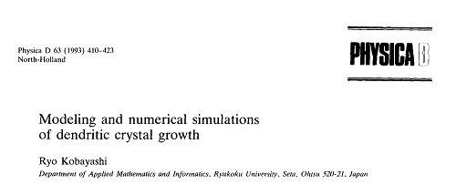
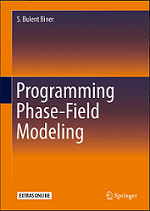
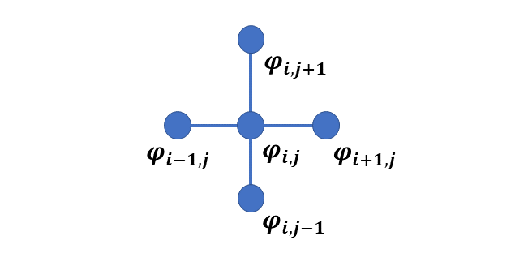
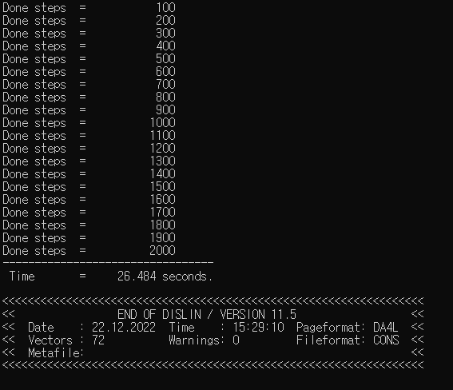
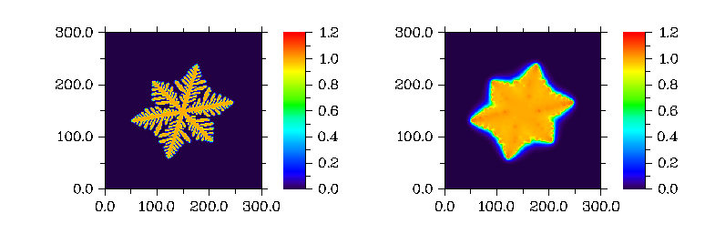
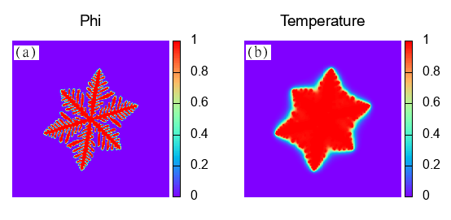

# **Fortran Phase-field Dendritic Solidification**

This code is a Fortran version of Dendritic solidification. [It](https://www.sciencedirect.com/science/article/pii/016727899390120P) is one of the earliest phase-field models for the dendritic solidification.

<div style="text-align: center;">



</div>

___

**Note:**
This code is the Fortran version of the code published by S. Bulent Biner in the [book](https://link.springer.com/book/10.1007/978-3-319-41196-5) **Programming Phase-field Modeling** as **fd_den_v1.m**, **section 4.7 Case Study-IV**. Our code however uses **Dislin library** for the interactive display. 



This document is separated into sections and written in a self-contained way.

* Mathematical model
* Numerical method
* Fortran implementation
* Finite difference codes

The first part describes the phase-field model. Next part presents the numerical simulation method i.e. finite difference. The third section demonstrates: How to implement the code, and what are the expected outputs? The following section explains the codes. 

# **Mathematical Model**

The model has two variables: Phi field $\varphi(r, t)$ and the temperature field $T(r, t)$. $\varphi(r, t)$ field is a non conserved order parameter and takes the value 0 and 1 in the liquid and solid phase. The temperature field evolves as the solidification field evolves.

### **Free energy function**

The free energy is of Ginzburg-Landau type

$$
F(\varphi, m)=\int_V \frac{1}{2} \varepsilon^2|\nabla \varphi|^2+f(\varphi, m) d v
$$

The first term is gradient energy and the second one is bulk free energy. The second term satisfy the condition of local free energy minimum at $\varphi=0$ in liquid and $\varphi=1$ in the solid. $m$ is the driving force. The functional form of the equation is

$$
f(\varphi, m)=\frac{1}{4} \varphi^4-\left(\frac{1}{2}-\frac{1}{3} m\right) \varphi^3+\left(\frac{1}{4}-\frac{1}{2} m\right) \varphi^2
$$

The interfacial anisotropy is directional dependent. It is

$$
\varepsilon=\bar{\varepsilon} \sigma(\theta)
$$

$\bar{\varepsilon}$ is a mean value of $\varepsilon$. The anisotropy $\sigma(\theta)$ is 

$$ \sigma(\theta)= 1 + \delta cos(j(\theta - \theta_0)) $$

The angle is given by

$$
\theta=\tan ^{-1}\left(\frac{\partial \varphi / \partial y}{\partial \varphi / \partial x}\right)
$$

The parameter $m$ is given by

$$ m(T) = \left(\frac{\alpha}{\pi} \right) \tan^{-1}[\gamma(T_{eq} - T)]$$

**The Allen-Cahn equation** for evolution is

$$
\tau \frac{\partial \varphi}{\partial t}=-\frac{\delta F}{\delta \phi}
$$

After functional derivative 

$$
\tau \frac{\partial \varphi}{\partial t}=\frac{\partial}{\partial y}\left(\varepsilon \frac{\partial \varepsilon}{\partial \theta} \frac{\partial \varphi}{\partial x}\right)-\frac{\partial}{\partial x}\left(\varepsilon \frac{\partial \varepsilon}{\partial \theta} \frac{\partial \varphi}{\partial y}\right)+\nabla \cdot\left(\varepsilon^2 \nabla \varphi\right)+\varphi(1-\varphi)\left(\varphi-\frac{1}{2}+m\right)
$$

**The evolution of temperature field**

$$
\frac{\partial T}{\partial t}=\nabla^2 T+\kappa \frac{\partial \varphi}{\partial t}
$$

# **Numerical method**

Because the model is a partial differential equation (PDE), numerous numerical approaches for solving the equations are available. For the sake of simplicity, we use finite difference method here.

Finite difference algorithms are a straightforward method for solving phase field equations. They convert the derivative to the difference equation at each grid point.

FD techniques include backward difference, forward difference, centered difference, and centered second difference. We utilize five point stencils for our Laplace operator evaluation, which is given by

$$\nabla^2 \varphi = \frac{\varphi_{i+1,j} + \varphi_{i-1,j} + \varphi_{i,j+1} + \varphi_{i,j-1} -4\varphi_{i,j}} {dxdy}$$

Graphically it is
<div style="text-align: center;">


</div>

The periodic boundary conditions are 

$$  \varphi_{0,j} = \varphi_{N_x,j}     $$ 

$$  \varphi_{N_x+1,j} = \varphi_{1,j}   $$

$$  \varphi_{i,0} = \varphi_{i,N_y}     $$ 

$$  \varphi_{i,N_y+1} = \varphi_{i,1}   $$

Using explicit Euler time marching scheme, the evolution equation becomes

$$\frac{\varphi^{\varphi+1}-\varphi^n}{\Delta t}=-L\left(\frac{\partial f}{\partial \varphi}-\kappa \nabla^2 \varphi\right) $$

after rearrangement

$$\varphi^{\varphi+1}=\varphi^n-L \Delta t \left(\frac{\partial f}{\partial \varphi}-\kappa \nabla^2 \varphi\right)$$

# **Fortran implementation**

To run Fortran code you may have a compiler installed. For this simulation we use gfortran and intel compilers. 

**gfortran compiler**

The following takes you to the installation of gfortran compiler.

https://www.linkedin.com/learning/introduction-to-fortran?trk=course_title&upsellOrderOrigin=default_guest_learning

**intel compiler**

https://www.intel.com/content/www/us/en/developer/tools/oneapi/hpc-toolkit-download.html

Two Fortran codes are there. The first one **fd_dendrite_dislin.f90** is using dislin library and second one **fd_dendrite.f90** without dislin.

## **with Dislin**
It is assumed that you have [dislin graphical library](https://dislin.de/) installed. Use **double precision module** for the code.

### **fd_dendrite_dislin.f90**

For **Linux OS** &mdash; with **gfortran** &mdash; to compile, enter
>gfortran fd_dendrite_dislin.f90 -o fd_dendrite_dislin -L/usr/local/dislin/ -I/usr/local/dislin/gf/real64 -ldislin_d

and to run, enter
>./fd_dendrite_dislin

and for **windows** &mdash; with **gfortran** and with **intel** &mdash; to compile, enter
>gfortran fd_dendrite_dislin.f90 -o fd_dendrite_dislin -Ic:\dislin\gf\real64  c:\dislin\dismg_d.a -luser32 -lgdi32  -lopengl32

>ifort fd_dendrite_dislin.f90 -Ic:\dislin_intel\ifc\real64 c:\dislin_intel\disifl_d.lib user32.lib gdi32.lib opengl32.lib

and to run, enter
>fd_dendrite_dislin

**fd_dendrite_dislin** is the name of file with .f90 extension. **fd** stands for **finite difference** and **dendrite** for **dendritic solidification**. **dislin** refers to the use of dislin for this code.

* If the code runs successfully, it will produce following output. The first part prints the done steps and the computed time. The second part shows dislin plotting library information.

<div style="text-align: center;">


</div>

**The compute time may vary**
* The expected dislin plot of evolution is given below. <span style="color:red"> **Note:**</span> the figure is shown on the console and is not saved. 



## **without Dislin**

If dislin is not installed use this code file.

**fd_dendrite.f90**

For **Linux OS** &mdash; with **gfortran** &mdash; to compile, enter
>gfortran fd_dendrite.f90 -o fd_dendrite

and to run, enter
>./fd_dendrite

and for **windows** &mdash; with **gfortran** and with **intel** &mdash; to compile, enter
>gfortran fd_dendrite.f90 -o fd_dendrite

>ifort fd_dendrite.f90 

and to run, enter
>fd_dendrite

In both codes, the ouput files **phi.dat**, and  **temperature.dat** are created.

### **gnuplot commands**

You may use any graphical software to get the plot. For gnuplot use the following commands.

```
cd 'D:\Fortran'
set term qt 0 size 600,600
set multiplot layout 1,2 margins 0.1,0.9,0.1,0.9 spacing 0.15
set size ratio 1
set xrange [*:*] noextend
set yrange [*:*] noextend
set view map
set pm3d map interpolate 10,10
set palette rgbformulae 33,13,10
set cbrange[0:1]
unset key
unset xtics
unset ytics
unset border
# ----------------------------------------------------------------
set title 'Phi' font ',14'
set label 1 '(a)' at 5,275 front font ' , 14' tc 'black' boxed
set style textbox opaque fc "white" noborder
splot 'phi.dat' matrix with pm3d
unset label 1
# -----------------------------------------------------------------
set title 'Temperature' font ',14'
set label 2 '(b)' at 5,275 front font ' , 14' tc 'black' boxed
set style textbox opaque fc "white" noborder
splot 'temperature.dat' matrix with pm3d
unset label 2
# -----------------------------------------------------------------
unset multiplot
```
<span style="color:red"> **Note:**</span> The first line is the path where the file is located. In our case it is placed in `D` drive. The rest of the commands remain the same!

The output is

<div style="text-align: center;">


</div>

# **Finite difference codes**

Here we briefly describe the codes. All parameters are non-dimensional.

## **fd_dendrite.f90** and  **fd_dendrite_dislin.f90**

The difference between two files is of these two sections

1. use Dislin statement
2. dislin multiplot section

The Fortran program starts with the **program fd_Kobayashi_model_test** and ends with **end program fd_Kobayashi_model_test**. The second statement **use Dislin** includes the Dislin library. **implicit none** avoids any default behaviour of the compiler for data declaration.

```Fortran
program fd_Kobayashi_model_test
  use Dislin
  implicit none
```
### **Data declaration**

The simulation cell size is 300 $\times$ 300. The grid spacing i.e., `dx` and `dy` is 0.03. 

```Fortran
  !--- simulation cell parameters

  integer ( kind = 4 ), parameter :: Nx = 300
  integer ( kind = 4 ), parameter :: Ny = 300
  real ( kind = 8 )               :: dx = 0.03
  real ( kind = 8 )               :: dy = 0.03
```

This section declares the number of steps for computation and the output frequency of results.  It defines the time increment with variable `dtime`. The variables `start` and `finish` are declared to calculate the time of the code execution.

```Fortran
  !--- time integeration parameters

  integer (kind = 4 ) :: nsteps = 2000
  integer (kind = 4 ) :: nprint = 100
  integer (kind = 4 ) :: tsteps 
  real ( kind = 8 )   :: dtime  = 1.0e-4
  real ( kind = 8 )   :: start, finish
```

This part is related to the microstructure parameters. Anisotropy `aniso = 6` will produce hexagonal lattice. To make square geometry change it to `4`. The initial radius is inserted with diameter `seed = 5.0`, `pix` calculates the value of $\pi$

```Fortran
  !--- material specific parameters

  real ( kind = 8 )   :: tau   = 0.0003
  real ( kind = 8 )   :: epsilonb = 0.01
  real ( kind = 8 )   :: mu    = 1.0
  real ( kind = 8 )   :: kappa = 1.8
  real ( kind = 8 )   :: delta = 0.02
  real ( kind = 8 )   :: aniso = 6.0
  real ( kind = 8 )   :: alpha = 0.9
  real ( kind = 8 )   :: gama  = 10.0
  real ( kind = 8 )   :: teq   = 1.0
  real ( kind = 8 )   :: theta0= 0.2 
  real ( kind = 8 )   :: seed  = 5.0

  real ( kind = 8 )   :: pix   = 4.0*atan(1.0)
```
We define the microstructure parameters in this declaration. All these parameters are explained above in the mathematical model section

```Fortran
  !--- initial nuclei and evolution parameters

  real ( kind = 8 ) , dimension( Nx, Ny ) :: phi, tempr
  real ( kind = 8 ) , dimension( Nx, Ny ) :: lap_phi, lap_tempr
  real ( kind = 8 ) , dimension( Nx, Ny ) :: phidx, phidy
  real ( kind = 8 ) , dimension( Nx, Ny ) :: epsil, epsilon_deriv
  real ( kind = 8 )                       :: phi_old, term1, term2
  real ( kind = 8 )                       :: theta, m
  integer ( kind = 4 )                    :: i, j, istep, ip, im, jp, jm
```

This statement (intrinsic subroutine call) is used for the initial time of the program. The input argument `start` is the starting time of the code execution.

```Fortran
  call cpu_time ( start )
```

### **Initial microstructure**

The section implements the initial microsturucture. The `initial temperature` and `phi fields` are `0` and the initial nuclei is inserted with `5.0` radius. This satisfies the condition for solid particle having $\varphi$ = 1. 

```Fortran
  !--- initialize and introduce initial nuclei
  
  phi = 0.0
  tempr = 0.0

  do i = 1, Nx
     do j = 1, Ny
        if ( (i - Nx/2.0)*(i - Nx/2.0) + (j - Ny/2.0)*(j - Ny/2.0)&
             & < seed ) then
           phi(i,j) = 1.0
        end if
     end do
  end do
```
### **Evolution**

The temporal and spatial discretization starts here. Note the use of construct name for the do loop &mdash; time_loop

```Fortran
!--- start microstructure evolution

  time_loop: do tsteps = 1, nsteps

     do i = 1, Nx
        do j = 1, Ny
```

This calculates $\nabla^2 \phi$ and $\nabla^2 T$, 

the angle,

$$
\theta=\tan ^{-1}\left(\frac{\partial \varphi / \partial y}{\partial \varphi / \partial x}\right)
$$ 

$\varepsilon$ 

i.e.,

$$
\varepsilon=\bar{\varepsilon} \sigma(\theta) 
$$ 

and its derivate 

$$
\frac{\partial \varepsilon}{\partial \theta}
$$

Notice the use of `if` statement instead of `if then` construct. It reduces the code size.

```Fortran
           jp = j + 1
           jm = j - 1

           ip = i + 1
           im = i - 1

           if ( im == 0 ) im = Nx
           if ( ip == ( Nx + 1) ) ip = 1
           if ( jm == 0 ) jm = Ny
           if ( jp == ( Ny + 1) ) jp = 1

           !--- laplacian

           lap_phi(i,j) = ( phi(ip,j) + phi(im,j) + phi(i,jm) + phi(i,jp)&
                & - 4.0*phi(i,j)) / ( dx*dy )
           lap_tempr(i,j) = ( tempr(ip,j) + tempr(im,j) + tempr(i,jm) + &
                & tempr(i,jp) - 4.0*tempr(i,j)) / ( dx*dy )

           !--- gradients

           phidx(i,j) = ( phi(ip,j) - phi(im,j) ) / dx
           phidy(i,j) = ( phi(i,jp) - phi(i,jm) ) / dy

           !--- angle

           theta  = atan2( phidy(i,j),phidx(i,j) )

           !--- epsilon and its derivative

           epsil(i,j) = epsilonb*( 1.0 + delta*cos(aniso*&
                & ( theta - theta0 ) ) )
           epsilon_deriv(i,j) = -epsilonb*aniso*delta*sin&
                & ( aniso*( theta - theta0 ) )

        end do
     end do
```
term1, term2 and m are evaluated here. 

**term1**

$$
\frac{\partial}{\partial y}\left(\varepsilon \frac{\partial \varepsilon}{\partial \theta} \frac{\partial \varphi}{\partial x}\right)
$$

**term2** 

$$
\frac{\partial}{\partial x}\left(\varepsilon \frac{\partial \varepsilon}{\partial \theta} \frac{\partial \varphi}{\partial y}\right)
$$

```Fortran
     do i = 1, Nx
        do j = 1, Ny

           jp = j + 1
           jm = j - 1

           ip = i + 1
           im = i - 1

           if ( im == 0 ) im = Nx
           if ( ip == ( Nx + 1) ) ip = 1
           if ( jm == 0 ) jm = Ny
           if ( jp == ( Ny + 1) ) jp = 1

           phi_old = phi(i,j)

           !--- term1 and term2

           term1 = ( epsil(i,jp)*epsilon_deriv(i,jp)*phidx(i,jp)&
                & - epsil(i,jm)*epsilon_deriv(i,jm)*phidx(i,jm) ) / dy
           term2 = -( epsil(ip,j)*epsilon_deriv(ip,j)*phidy(ip,j)&
                & - epsil(im,j)*epsilon_deriv(im,j)*phidy(im,j) ) / dx

           !--- factor m

           m = alpha/pix*atan( gama*( teq - tempr(i,j) ) )
```

Explicit Euler finite difference is implemented here

```Fortran
           !--- time integration

           phi(i,j) = phi(i,j) + ( dtime/tau )*( term1 + term2 +&
                & epsil(i,j)**2*lap_phi(i,j) ) + &
                & phi_old*( 1.0 - phi_old )*( phi_old -0.5 + m )
           tempr(i,j) = tempr(i,j) + dtime*lap_tempr(i,j) &
                & + kappa*( phi(i,j) - phi_old )

        end do
     end do
```

This section of the code prints the `done steps` on the screen.

```Fortran
    !--- print steps

     if ( mod( tsteps, nprint ) .eq. 0 ) print *, 'Done steps  =  ', tsteps
```
The microstructure evolution finishes here

```Fortran
     !--- end microstructure evolution

  end do time_loop
```

It takes the final time used for calculation. The statements will open the `.dat` format files &mdash; `phi.dat`, and `temperature.dat`. The output value of phi and temperature fields at the final time step are written separately in these files.

```Fortran

  call cpu_time ( finish )

  !--- write phi and temperature on the files and closes it
  
  open ( 1, file = "phi.dat" )
  open ( 2, file = 'temperature.dat')
  
  do i = 1, Nx
     write( 1, * ) ( phi(i,j), j = 1, Ny )
     write( 2, * ) ( tempr(i,j), j = 1, Ny )
  end do

  close( 1 )
  close( 2 )
```
This part prints the computed time on the screen

```Fortran
  !--- prints computed time on the screen

  print*,'---------------------------------'
  print '("  Time       = ", f10.3," seconds." )', finish - start
```
This plots the dislin color plot for both order parameters, and the last statement terminates the program. Note it is only in the file **fd_dislin_dislin.f90**

 <span style="color:green">`call metafl ( 'cons' )` </span> displays the output on the console. <span style="color:green">`call scrmod ( 'REVERS' )` </span> will make the background white, the default is black. The dislin is initiated with the routine <span style="color:green">`call disini ( )`</span>.  <span style="color:green">`call complx (  )` </span> sets the complex font. <span style="color:green"> `call axspos ( 350, 1700 )` </span> defines the axis position,  <span style="color:green"> `call ax3len ( 600, 600, 600 )` </span> define the axis position and the axis length of the colored axis system. The routine <span style="color:green"> `call graf3 ( )` </span> plots the 3D axis system with Z axis as a color bar. <span style="color:green">`call crvmat ( )` </span> plots color surface of the matrix. <span style="color:green"> `call endgrf ( )` </span> terminates the axis system. The dislin routine is finished with the routine <span style="color:green">`call disfin ( )` </span>

```Fortran
  !--- dislin multiplot

  call metafl ( 'cons' )
  call scrmod ( 'revers' )
  call disini ( )
  
  call complx ( )
  
  call axspos ( 400, 1500 )
  call ax3len ( 600, 600, 600 )
  call graf3 ( 0.d0, 300.d0, 0.d0, 100.d0, 0.d0, 300.d0,&
        & 0.d0, 100.d0, 0.0d0, 1.2d0, 0.0d0, 0.2d0 )
  call crvmat ( phi, Nx, Ny, 1, 1 )
  call endgrf

  call axspos ( 1700, 1500 )
  call ax3len ( 600, 600, 600 )
   call graf3 ( 0.d0, 300.d0, 0.d0, 100.d0, 0.d0, 300.d0,&
         & 0.d0, 100.d0, 0.0d0, 1.2d0, 0.0d0, 0.2d0 )
  call crvmat ( tempr, Nx, Ny, 1, 1 )
  call endgrf

  call disfin ( )

end program fd_Kobayashi_model_test
```
