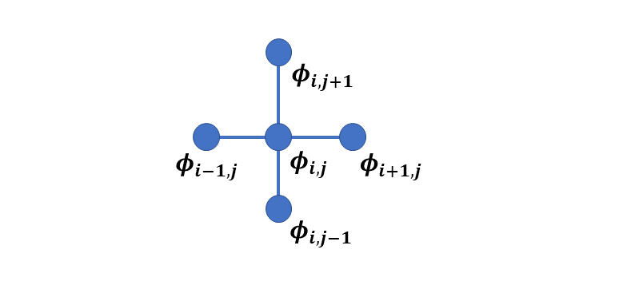
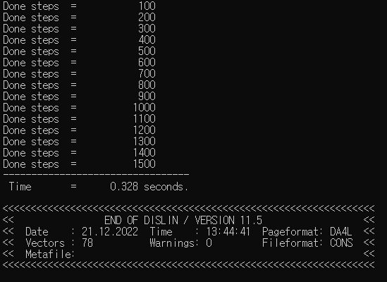
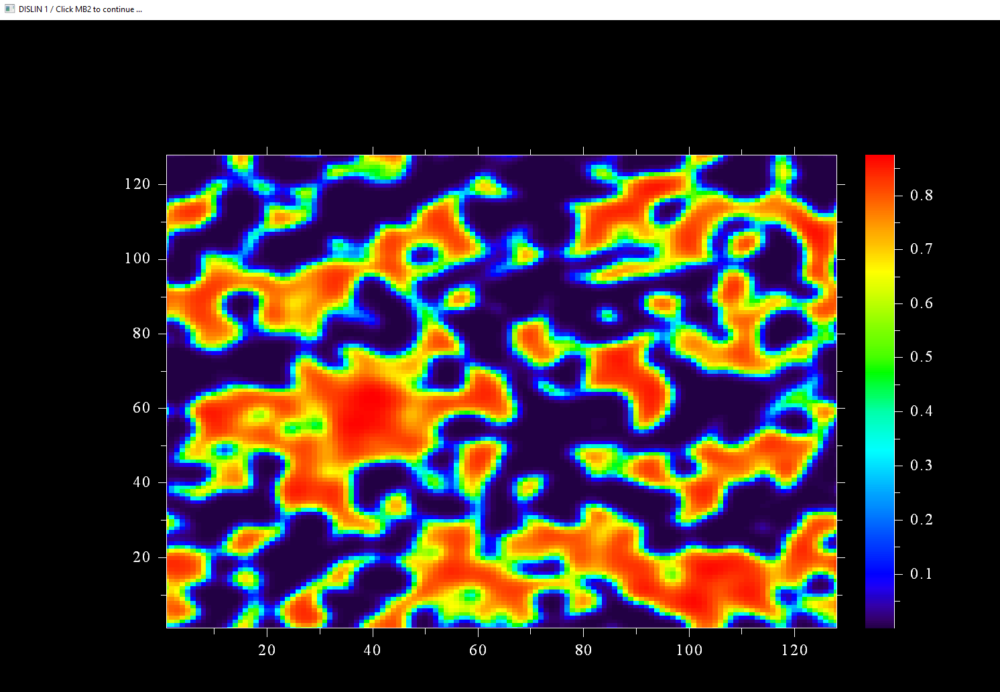
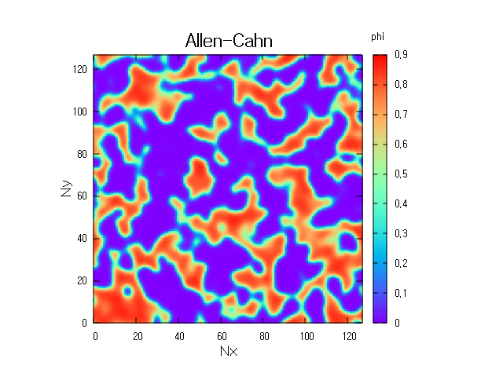

# **Fortran Phase-field Allen-Cahn Simulation**

This phase-field code is a 2D Fortran version of simulation of Allen-Cahn equation. This document presents the code in a self consistent manner. It is divided into these sections

* Mathematical model
* Numerical method
* Fortran implementation
* Finite difference code
* Optimization

The first part describes the phase-field model. Next part presents the numerical simulation method i.e. finite difference. The third section demonstrates: How to implement the code, and what are the expected outputs? The following section explains the codes. The final section shows how to optimize the code.

# **Mathematical Model**

### **Free energy function**

The total free energy **$F$** is given by

$$ F=\int\left[f\left(\phi\right)+\kappa\left(\nabla \phi\right)^2\right]dV$$

Where **$f(\phi)$** is the bulk chemical free energy density, **$\phi$** is the non-conserved order parameter, $\kappa$ is gradient energy coefficient. 

The bulk free energy is 

$$  f(\phi) = A\phi^2(1-\phi)^2  $$ 

$A$ is the height of the barrier.

### **Equation of evolution**

The evolution of conserved order parameter is  is linearly proportional to the variational derivative of free energy function . Mathematically it is


$$\frac{\partial \phi}{\partial t}=-L \frac{\delta F}{\delta \phi}$$

**$L$** is mobility

The variational derivative of **$F$** is

$$\frac{\delta F}{\partial \phi}=\left(\frac{\partial f}{\partial \phi}-\kappa \nabla^2 \phi\right)$$

The evolution equation now becomes

$$\frac{\partial \phi}{\partial t}=-L\left(\frac{\partial f}{\partial \phi}-\kappa \nabla^2 \phi\right)$$

The derivative of free energy function is 

$$ \frac{\partial f}{\partial \phi}= A\left( 2\phi(1-\phi)^2 (1-2\phi) \right) $$

# **Numerical method**

Since the AC equation is a partial differential equation (PDE), various numerical methods can be used for solving the equation. We use finite difference method here because of its simplicity.

Finite difference algorithms are simple and direct way to solve the phase field equations. They convert derivative to difference equation at each grid point to perform computation. 

There are various FD methods like backward difference, forward difference, centered difference and centered second difference methods. For our Laplace operator evaluation, we use five point stencils and is given by

$$\nabla^2 \phi = \frac{\phi_{i+1,j} + \phi_{i-1,j} + \phi_{i,j+1} + \phi_{i,j-1} -4\phi_{i,j}} {dxdy}$$

Graphically it is



Using explicit Euler time marching scheme, the evolution equation becomes

$$\frac{\phi^{n+1}-\phi^n}{\Delta t}=-L\left(\frac{\partial f}{\partial \phi}-\kappa \nabla^2 \phi\right) $$

after rearrangement

$$\phi^{n+1}=\phi^n - L \Delta t \left(\frac{\partial f}{\partial \phi} - \kappa \nabla^2 \phi\right)$$


# **Fortran implementation**

## **Compilers**

To run Fortran code you may have a compiler installed. For this simulation we use gfortran and intel compilers.  

**gfortran compiler**

The following takes you to the installation of gfortran compiler.

https://www.linkedin.com/learning/introduction-to-fortran?trk=course_title&upsellOrderOrigin=default_guest_learning

**intel compiler**

https://www.intel.com/content/www/us/en/developer/tools/oneapi/hpc-toolkit-download.html

Two Fortran codes are there. The first one **fd_ac_dislin.f90** is using dislin library and second one **fd_ac.f90** without dislin.

## **with Dislin**

It is assumed that you have **dislin graphical library** installed. The link to the library is
https://dislin.de/

### **fd_ac_dislin.f90**
For **Linux OS** &mdash; with **gfortran** &mdash; to compile, enter
>gfortran fd_ac_dislin.f90 -o fd_ac_dislin -L/usr/local/dislin/ -I/usr/local/dislin/gf/real64 -ldislin_d

and to run, enter
>./fd_ac_dislin

and for **windows** &mdash; with **gfortran** and with **intel** &mdash; to compile, enter
>gfortran fd_ac_dislin.f90 -o fd_ac_dislin -Ic:\dislin\gf\real64  c:\dislin\dismg_d.a -luser32 -lgdi32  -lopengl32

>ifort fd_ac_dislin.f90 -Ic:\dislin_intel\ifc\real64 c:\dislin_intel\disifl_d.lib user32.lib gdi32.lib opengl32.lib

and to run, enter
>fd_ac_dislin

**fd_ac_dislin** is the name of file with .f90 extension. **fd** stands for **finite difference** and **ac** for **Allen-Cahn**. **dislin** refers to the use of dislin for this code.

* If the code runs successfully, it will produce following output. The first part prints the done steps and the computed time. The second part shows dislin plotting library information.



**The compute time may vary**
* The expected dislin plot is given below. The exact picture may vary since we are using subroutine random numbers. The picture is displayed on the console and is not saved.



## **without Dislin**

If dislin is not installed then use this code file.

**fd_ac.f90**

For **Linux OS** &mdash; with **gfortran** &mdash; to compile, enter
>gfortran fd_ac.f90 -o fd_ac

and to run, enter
>./fd_ac

and for **windows** &mdash; with **gfortran** and with **intel** &mdash; to compile, enter
>gfortran fd_ac.f90 -o fd_ac

>ifort fd_ac.f90 

and to run, enter
>fd_ac

### **Note**
In both codes, the ouput file **ac.dat** is created. The file stores the value of order parameter for the last time step.

### **gnuplot commands**

You may use any graphical software to get the plot. For gnuplot use these commands:

```gnuplot
cd 'D:\Fortran'
set view map
set size square
set xrange [*:*] noextend
set yrange [*:*] noextend
set key title 'phi' at 143, 138
set title 'Allen-Cahn'font ',18'
set xlabel 'Nx' font ',14'
set ylabel 'Ny' font ',14'
set palette rgbformulae 33,13,10
set pm3d map interpolate 9,9
splot 'ac.dat' matrix with pm3d notitle
```
**Note:** The first line is the path where the file is located. In our case it is placed in **D** drive. The rest of the commands remain the same!

The output is



# **Finite difference code**

Here we briefly describe the code. All parameters are non dimensional.

## **fd_ac.f90** and  **fd_ac_dislin.f90**

The difference between two files is of these two statements

1. use Dislin
2. call qplclr ( phi, Nx, Ny)

The Fortran program starts with the **program fd_ac_test** and ends with **end program fd_ac_test**. The second statement **use Dislin** includes the Dislin library. **implicit none**  avoids any default behaviour of the compiler for data declaration.

```Fortran
program fd_ac_test
  use Dislin
  implicit none
```
### **Data declaration**

The simulation cell size is 128 $\times$ 128. The larger cell size increases the computational cost and if desired could be modified here. The grid spacing i.e., **dx** and **dy** is 2

```Fortran
  !-- simulation cell parameters

  integer ( kind = 4 ), parameter :: Nx = 128
  integer ( kind = 4 ), parameter :: Ny = 128
  integer ( kind = 4 ), parameter :: dx = 2
  integer ( kind = 4 ), parameter :: dy = 2
```
This section declares the desired number of steps and the output frequency of the timesteps. The input arguments for start and end time calculations are declared here too.

```Fortran
  !--- time integration parameters

  integer ( kind = 4 ), parameter :: nsteps = 1500
  integer ( kind = 4 ), parameter :: nprint = 100
  integer ( kind = 4 )            :: tsteps
  real    ( kind = 8 ), parameter :: dt     = 0.01
  real    ( kind = 8 )            :: start, finish
```

This part is related to the microstructure parameters. The section defines the initial concentration, the gradient coefficients and the mobility.

```Fortran
  !--- material specific parameters

  real ( kind = 8 )   , parameter :: phi_0 = 0.5
  real ( kind = 8 )   , parameter :: mobility = 1.0
  real ( kind = 8 )   , parameter :: grad_coef = 1.0
```
We define the microstructure parameters in this declaration. **noise** is the thermal fluctuation, **A** is the height of the energy barrier. **i, j, jp, jm, ip, im** are the spatial discretization variables. **r** is for random number, 2 dimensional **phi** variable stores the evolution of the non conserved order parameter. **dfdphi** is a 2 dimensional array to store the derivative of free energy. **lap_phi**, **dummy_phi** are 2 dimensional variable arrays for laplace evaluation. 

```Fortran
  !--- microstructure parameters

  real ( kind = 8 )   , parameter :: noise = 0.02
  real ( kind = 8 )   , parameter :: A  = 1.0
  integer ( kind = 4 )            :: i, j, jp, jm, ip, im
  real ( kind = 8 )   , dimension ( Nx, Ny ) :: r, phi, dfdphi
  real ( kind = 8 )   , dimension ( Nx, Ny ) :: lap_phi, dummy_phi
```
This statement will open the file **ac.dat**. The value of phi at the final time step is written in it.

```Fortran
  open ( 1, file = "ac.dat" )
```
This statement (intrinsic subroutine call) is used for the initial time of the program. The input argument **start** is the starting time of the code execution.

```Fortran
  call cpu_time ( start )
```
### **Initial microstructure**

The section introduces the initial microsturucture. **call random_number ( r )** is a subroutine to store the random numbers in a 2 dimensional variable **r**

```Fortran
  !--- initial microstructure

  call random_number ( r )

  phi = phi_0 + noise*( 0.5 - r )
```
### **Evolution**

This part starts the evaluation at each time step for all grid points. **time_loop** is the statement label for the time do loop. **row** and **column** are statment labels for i and j do loops respectively.

```Fortran
  !--- start microstructure evolution

  time_loop: do tsteps = 1, nsteps

     row: do i = 1, Nx
        column: do j = 1, Ny
```
This calculates the derivative of free energy at each grid point
```Fortran
           !--- free energy derivative

           dfdphi(i,j) = A*( 2.0*phi(i,j)*( 1.0 - phi(i,j) )**2 &
                *( 1.0 - 2*phi(i,j) ) )
```
This evaluates Laplacian. Note the use of **if** statement instead of **if then** construct. It reduces the code size.

```Fortran
           !--- laplace evaluation

           jp = j + 1
           jm = j - 1

           ip = i + 1
           im = i - 1

           if ( im == 0 ) im = Nx
           if ( ip == ( Nx + 1) ) ip = 1
           if ( jm == 0 ) jm = Ny
           if ( jp == ( Ny + 1) ) jp = 1

           lap_phi(i,j) = ( phi(ip,j) + phi(im,j) + phi(i,jm) + &
                phi(i,jp) - 4.0*phi(i,j)) /( dx*dy )              

           dummy_phi(i,j) = dfdphi(i,j) - grad_coef*lap_phi(i,j)
```

The code implements explicit Euler finite difference here

```Fortran
           !--- time integration

           phi(i,j) = phi(i,j) - dt*mobility*dummy_phi(i,j)
```

This maintains the order parameters between **0** and **1**. The evaluation at each grid point finishes in this section. 

```Fortran
           !--- for small deviations

           if ( phi(i,j) >= 0.99999 ) phi(i,j) = 0.99999
           if ( phi(i,j) < 0.00001 )  phi(i,j) = 0.00001

        end do column
     end do row
```

This section of the code prints the performed number of steps on the screen.

```Fortran
    !--- print steps

     if ( mod( tsteps, nprint ) .eq. 0 ) print *, 'Done steps  =  ', tsteps
```
The microstructure evolution finishes here
```Fortran
     !--- end microstructure evolution

  end do time_loop
```
It takes the final time used for calculation, writes the value of **phi** in the file **ac.dat** and closes the file.

```Fortran
  call cpu_time ( finish )

  !--- write concentration on the file and closes it

  do i = 1, Nx
     write( 1, * ) ( phi(i,j),j = 1, Ny )
  end do

  close( 1 )
```
This is the quick dislin plot in colors and the last statement terminates the program. Note it is only in the file **fd_ac_dislin.f90**

```Fortran
  !--- quick Dislin color plot

  call qplclr ( phi, Nx, Ny )

end program fd_ac_test
```

# **Optimization**

The codes are not optimized. You can interchange loops and use the do concurrent. Also use the compiler flags like -O3.
