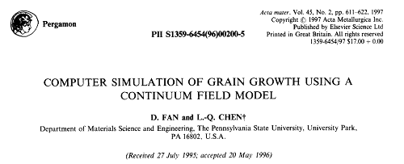
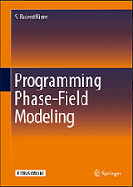
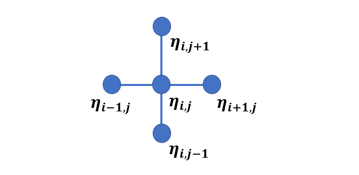
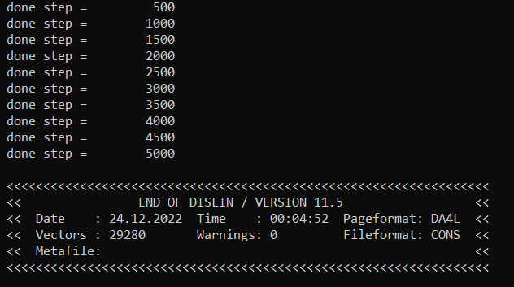
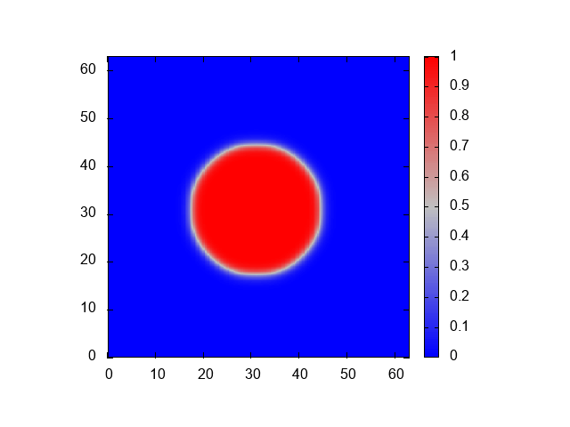

# **Fortran Phase-field code for 2 grains**

This phase-field grain growth code is a 2D Fortran version of grain growth model by Fan and Chen. It is a diffuse interface phase-field model describing continuous representation of field variables. The field variables describe polycrystalline grain evolution in spatial and temporal scale with Ginzburg-Landau time dependent equation.

The original work considers different number of grains 4, 20, 36 and 50. To keep things simple, ***this document only shows how to code grain growth for 2 grains***.

[Link to the paper](https://www.sciencedirect.com/science/article/pii/S1359645496002005)

<div style="text-align: center;">


</div>


**Note:**
This code is the Fortran version of the code published by S. Bulent Biner in the book **Programming Phase-field Modeling** as **fd_ca_v1.m**, **section 4.5 Case Study-2** with **iflag = 1**. This code however uses **Dislin library** for the interactive display of the evolution of the grain. 

The link to the book is

https://link.springer.com/book/10.1007/978-3-319-41196-5



This document presents the code in a self-consistent manner. It is divided into these sections

* Mathematical model
* Numerical method
* Fortran implementation
* Finite difference codes

The first part describes the phase-field model. Next part presents the numerical simulation method i.e. finite difference. The third section demonstrates: How to implement the code, and what are the expected outputs? The following section explains the codes. 

# **Mathematical Model**

### **Free energy function**

The free energy function for *P* grains is given by

$$f_0\left(\eta_1, \eta_2, \eta_3, ...\eta_p\right)= \sum_{i=1}^p \left(-\frac{\alpha}{2} \eta_i^2+\frac{\beta}{4}\eta_i^4\right )  + \gamma \sum_{i=1}^p \sum_{j \neq i}^p \eta_i^2 \eta_j^2 $$ 

where **$\eta_1$**, **$\eta_2$**, **$\eta_3$**,and **$\eta_p$** are order parameters for grain 1, grain 2, grain 3 and grain $p$ respectively.  **$\alpha$** , **$\beta$** and **$\gamma$** are positive constants. They are assumed 1 for simplicity.

### **Equation of evolution**

The evolution of non-conserved order parameter is given by Allen-Cahn equation. It is linearly proportional to the variational derivative of free energy function w.r.t. the local orientation field variable. Mathematically it is

$$\frac{\partial \eta_i}{\partial t}=-L_i \cdot \frac{\delta F}{\delta \eta_i}$$

$\eta_i$ is local order parameter, ***t*** is time, ***L*** is relaxation coefficient and ***F*** is total free energy. **$\kappa$** is gradient energy coefficient. 

$$\frac{\delta F}{\partial \eta_i}=\left(\frac{\partial f}{\partial \eta_i}-\kappa_i \nabla^2 \eta_i\right)$$

# **Numerical method**

Since the AC equation is a partial differential equation (PDE), various numerical methods can be used for solving the equation. We use finite difference method here because of its simplicity.

Finite difference algorithms are simple and direct way to solve the phase field equations. They convert derivative to difference equation at each grid point to perform computation. 

There are various FD methods like backward difference, forward difference, centered difference and centered second difference methods. For our Laplace operator evaluation, we use five point stencils and is given by

$$\nabla^2 \eta_i = \frac{\eta_{i+1,j} + \eta_{i-1,j} + \eta_{i,j+1} + \eta_{i,j-1} -4\eta_{i,j}} {dxdy}$$

Graphically it is

<div style="text-align: center;">


</div>

Using explicit Euler time marching scheme, the evolution equation becomes

$$\frac{\eta_i^{\eta+1}-\eta_i^n}{\Delta t}=-L_i\left(\frac{\partial f}{\partial \eta_i}-k_i \nabla^2 \eta_i\right) $$

after rearrangement

$$\eta_i^{\eta+1}=\eta_i^n-L_i \Delta t \left(\frac{\partial f}{\partial \eta_i}-k_i \nabla^2 \eta_i\right)$$

# **Fortran implementation**

## **Compilers**

To run Fortran code you may have a compiler installed. For this simulation we use gfortran and intel compilers.  

**gfortran compiler**

The following takes you to the installation of gfortran compiler.

https://www.linkedin.com/learning/introduction-to-fortran?trk=course_title&upsellOrderOrigin=default_guest_learning

**intel compiler**

https://www.intel.com/content/www/us/en/developer/tools/oneapi/hpc-toolkit-download.html

Two Fortran codes are there. The first one **fd_grain_2_dislin.f90** is for dislin and second one **fd_grain_2.f90** without dislin.

## **with Dislin**
It is assumed that you have **dislin graphical library** installed. The link to the library is https://dislin.de/. Use double precision dislin module for this code.

### **fd_grain_2_dislin.f90**

For **Linux OS** &mdash; with **gfortran** &mdash; to compile, enter
>gfortran fd_grain_2_dislin.f90 -o fd_grain_2_dislin -L/usr/local/dislin/ -I/usr/local/dislin/gf/real64 -ldislin_d

and to run, enter
>./fd_grain_2_dislin

and for **windows** &mdash; with **gfortran** and with **intel** &mdash; to compile, enter
>gfortran fd_grain_2_dislin.f90 -o fd_grain_2_dislin -Ic:\dislin\gf\real64  c:\dislin\dismg_d.a -luser32 -lgdi32  -lopengl32

>ifort fd_grain_2.f90 -Ic:\dislin_intel\ifc\real64 c:\dislin_intel\disifl_d.lib user32.lib gdi32.lib opengl32.lib

and to run, enter
>fd_grain_2_dislin

**fd_grain_2_dislin** is the name of file with .f90 extension. **fd** stands for **finite difference** and **grain** for **grain growth** simulation with **2** number of grains. **dislin** refers to the use of dislin for this code.

* If the code runs successfully, it will produce following output.



* The expected dislin animation is given below.

<div style="text-align: center;">


</div>

## **without Dislin**

If dislin is not installed then use this code file.

**fd_grain_2.f90**

For **Linux OS** &mdash; with **gfortran** &mdash; to compile, enter
>gfortran fd_grain_2.f90 -o fd_grain_2

and to run, enter
>./fd_grain_2

and for **windows** &mdash; with **gfortran** and with **intel** &mdash; to compile, enter
>gfortran fd_grain_2.f90 -o fd_grain_2 

>ifort fd_grain_2.f90 

and to run, enter
>fd_grain_2

If the code runs successfully, it shows the done steps on the command line and will create the ouput files `grain_500.dat, grain_1000, grain_1500, grain_2000, grain_2500, grain_3000, grain_3500, grain_4000, grain, grain_4500, grain_5000`.

### **gnuplot commands**

You may use any graphical software to get the plot. For gnuplot http://www.gnuplot.info/download.html use these commands:

```
cd 'D:\Fortran'
set terminal gif animate delay 0.01  
set view map 
set size square 
set xrange [*:*] noextend 
set yrange [*:*] noextend 
set palette defined (0 'blue', 0.5 'grey', 1 'red') 
set pm3d map interpolate 9,9 
set out 'gnuplot_animation_grain.gif' 
n=500 
while (n <=5000) {   
fname = sprintf('grain_%d.dat', n ) 
splot fname matrix with pm3d notitle  
n=n+500 
 } 
unset output 
```
**Note:** The first line is the path where the file is located. In our case it is placed in `D` drive. The rest of the commands remain the same!

The output is the animation of grain evolution.

<div style="text-align: center;">


</div>

# **Finite difference codes**

Athough the code is written with related comments and declaration at each stage and is easy to follow, we will nonetheless briefly describe the code. All parameters are non dimensional. First code is with dislin and the second one without dislin.

* **fd_grain_2_dislin.f90**

The Fortran program starts with the **program fd_grain_2_test** and ends with **end program fd_grain_2_test**. The second statement **use Dislin** is used to include the Dislin library. **implicit none** avoids any default behaviour of the compiler for data declaration.

```Fortran
program fd_grain_2_test
  use Dislin
  implicit none
```
### **Data declaration**

The simulation cell size is declared here. The grid points in `x direction` and `y directions` are 64. The total simulation cell size is 64 $\times$ 64. The grid spacing i.e., `dx` and `dy` is 0.5

```Fortran
  !-- simulation cell parameters

  integer( kind = 4 ), parameter :: Nx = 64
  integer( kind = 4 ), parameter :: Ny = 64
  integer( kind = 4 ), parameter :: NxNy = Nx*Ny
  real   ( kind = 8 ), parameter :: dx = 0.5
  real   ( kind = 8 ), parameter :: dy = 0.5
```
The total number of time step are declared here, and the frequency of output time steps is set with `nprint`. The time increment is set with `dt` and time step iterations are declared with variable `istep`

```Fortran
  !--- time integration parameters

  integer( kind = 4 ), parameter :: nstep  = 5000
  integer( kind = 4 ), parameter :: nprint = 500
  real   ( kind = 8 ), parameter :: dt  = 0.005
  integer ( kind = 4 )           :: istep
```

The material specific parameters like `mobility` and `gradient coefficient` are declared here.

```Fortran
  !--- material parameters

  real   ( kind = 8 ), parameter :: mobility  = 5.0
  real   ( kind = 8 ), parameter :: grad_coef = 0.1
```
This part is related to the initial microstructure. It declares the number of grains and the inital radius and the parameters to insert the initial grain. The variable `etas` is declared to store the values of grains at each grid point.

```Fortran
  !--- initial grain structure parameters

  integer( kind = 4 ), parameter :: ngrain = 2
  real   ( kind = 8 ), parameter :: radius = 14.0
  real   ( kind = 8 ), dimension( Nx,Ny,ngrain ) :: etas
  real   ( kind = 8 ) :: xlength, x0, y0 
```

Since derivative of free energy and laplacian is performed during the evolution of the system we define these parameters in the evolution parameters

```Fortran
  !--- evolution and free energy parameters

  real   ( kind = 8 ), dimension( ngrain ) :: glist
  real   ( kind = 8 ), dimension( Nx,Ny )  :: eta, dfdeta, lap_eta
  real   ( kind = 8 ), parameter :: A = 1.0, B = 1.0
  integer( kind = 4 ) :: i, j, jp, jm, ip, im, igrain, jgrain
  real   ( kind = 8 ) :: summ, grain_sum
```

### **Initial microstructure**
The section implements the initial microsturucture. The initial radius with `14dx` dimenstion is placed in the system.

```Fortran
  !--- inital microstructure

  x0 = Nx/2
  y0 = Ny/2

  do i = 1, Nx
     do j = 1, Ny

        etas(i,j,1) = 1.0
        etas(i,j,2) = 0.0

        xlength = sqrt( ( i - x0 )**2 + ( j - y0 )**2 )

        if ( xlength <= radius ) then
           etas(i,j,1) = 0.0
           etas(i,j,2) = 1.0
        end if

     end do
  end do
```

The glist is initlialized here

```Fortran
  !--- initialize glist

  do igrain = 1, ngrain
     glist(igrain) = 1.0
  end do
```

### **Evolution**
Since the code shows the continous color plot, a few dislin subroutines are called here. The first one <span style="color:green">`call scrmod ( 'REVERS' )` </span> will make the background white, the default is black. The second one <span style="color:green">`call metafl ( 'cons' )` </span> displays the output on the console. After these two routines the dislin is initiated with the routine <span style="color:green">`call disini ( )`</span>. 

```Fortran
  !--- starts microstructure evolution

  call scrmod ( 'REVERS' )
  call metafl ( 'cons' )
  call disini ( )
```
The iteration starts here. If the condition is met, the loop will continue otherwise the grain does not exist anymore.

``` Fortran
time_loop: do istep = 1, nstep

     do igrain = 1, ngrain
        if ( glist(igrain) == 1 ) then
           do i = 1, Nx
              do j = 1, Ny
                 eta(i,j) = etas(i,j, igrain)
              end do
           end do
```

This calculates Laplacian. We have used `if statement` rather than `if then` construct. It reduces code size.

```Fortran
           do i = 1, Nx
              do j = 1, Ny

                 jp = j + 1
                 jm = j - 1

                 ip = i + 1
                 im = i - 1

                 if ( im == 0 ) im = Nx
                 if ( ip == ( Nx +1 ) ) ip = 1
                 if ( jm == 0) jm = Ny
                 if ( jp == ( Ny + 1) ) jp = 1

                 !--- laplace evaluation

                 lap_eta(i,j) = ( eta(ip,j) + eta(im,j) + eta(i,jm) + &
                      eta(i,jp) - 4.0*eta(i,j) ) / ( dx*dy )
```

The free energy derivative is evaluated here

```Fortran
                 !--- derivative of free energy

                 summ = 0.0

                 do jgrain = 1,ngrain
                    if ( jgrain /= igrain ) then
                       summ = summ + etas(i,j,jgrain)**2
                    end if
                 end do

                 dfdeta(i,j) = A*( 2.0*B* eta(i,j)*summ  + eta(i,j)**3 &
                      - eta(i,j) )
```

the explicit Euler integration scheme is implemented here. The maximum and minimum values are set here too to avoid deviations.

```Fortran
                 !--- time integration

                 eta(i,j) = eta(i,j) - dt*mobility*( dfdeta(i,j) &
                      - grad_coef*lap_eta(i,j) )

                 !-- for small deviations

                 if ( eta(i,j) >= 0.9999 ) eta(i,j) = 0.9999
                 if ( eta(i,j) < 0.00001 ) eta(i,j) = 0.00001

              end do
           end do
```
This calcuate the total area of the current grain and brings back the order parameter from the temporary array to main array. It also checks the area fraction of the current grain. If it is less than `0.001` then the grain does not exist.

```Fortran
           grain_sum = 0.0

           do i = 1, Nx
              do j = 1, Ny
                 etas(i,j,igrain) = eta(i,j)
                 grain_sum = grain_sum + eta(i,j)
              end do
           end do

           !--- check volume fraction of current grain

           grain_sum = grain_sum / NxNy

           if ( grain_sum <= 0.001 ) then
              glist(igrain) = 0
           end if

        end if
     end do
```
This section of the code shows the done steps.

```Fortran
     !--- print done steps

     if ( mod ( istep, nprint ) .eq. 0 ) print *, 'Done steps  =  ', istep
```
The last section implements the remaining dislin routines for continuous plot and terminates the program. <span style="color:green">`call pagera (  )`</span> displayes border around the page. <span style="color:green">`call hwfont (  )`</span> sets the standard hardware font. <span style="color:green">`call titlin ( 'Contour Plot', 4 )`</span> defines the four lines of text for axis system title. <span style="color:green">`call name ( 'Nx', 'X' )`</span> defines axis titles. <span style="color:green">`call intax ( )` </span> labels the axes with integers. <span style="color:green">`call autres ( Nx, Ny )`</span> calculates the size of colored rectangles. <span style="color:green">`call axspos ( 350, 1700 ),  call ax3len ( 1400, 1400, 1400 )`</span> define the axis position and the axis length of the colored axis system. <span style="color:green">`call labdig ( 2, 'Z' )`</span> defines the number of decimal places for the z axis. Once the dislin parameters are set we call the dislin graf for the output frequency. The routine <span style="color:green">`call graf3 ( )` </span> plots the 3D axis system with Z axis as a color bar. <span style="color:green">`call crvmat ( )` </span> plots color surface of the matrix. <span style="color:green"> `call height ( 50 )`, `call title ( )` </span> define the charachter height and display the title. The dislin routine is finished with the routine <span style="color:green"> `call disfin ( )` </span>

```Fortran
 !--- dislin color animation

     call pagera ( )
     call hwfont ( )

     call titlin ( 'Contour Plot', 4 )

     call name ( 'Nx', 'X' )
     call name ( 'Ny', 'Y' )
     call name ( 'eta', 'Z' )

     call intax ( )
     call autres ( Nx, Ny )
     call axspos ( 350, 1700 )
     call ax3len ( 1400, 1400, 1400 )

     call labdig ( 2, 'Z' )     

     if ( mod(istep,nprint) .eq. 0 ) then 
        call erase ( )  
        call graf3 ( 0.d0, 64.d0, 0.d0, 8.d0, 0.d0, 64.d0,&
             & 0.d0, 8.d0, 0.05d0, 1.0d0, 0.05d0, 0.05d0 )
        call crvmat ( eta, Nx, Ny, 1, 1 )   

        call height ( 50 )
        call title ( )
        call mpaepl ( 3 )

        call endgrf
        call sendbf ( )
     end if

  end do time_loop

  call disfin ( )

  end program fd_grain_2_test
```

* **fd_grain_2.f90**

This code does not use dislin library and saves the files to be used for the animation with gnuplot. 

The main difference is that none of the routines related to dislin are present, and the final section prints the completed steps and saves the files with an output frequency i.e., `nprint`. This segment employs the block construct to declare filenames and file opening units in local variables and writes the values in the matrix format.

```Fortran
     !--- print done steps and write the values on files

     writing_files:block
       character ( len = 80 ) :: filename 
       integer ( kind = 4 )   :: lun

       if ( mod ( istep, nprint ).eq.0 ) then
          print*, 'done step =', istep
          write ( filename, '( "grain_", i0.3, ".dat" )') istep
          open ( newunit = lun, file = filename, status = 'replace' )
          do i = 1, Nx    
             write ( lun, * ) ( eta( i, j), j = 1, Ny )
          end do
          close ( unit = lun )
       endif

     end block writing_files
```
