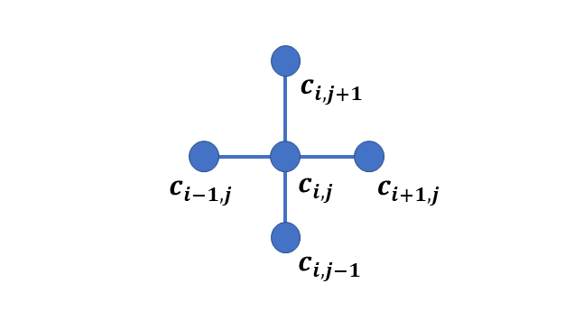
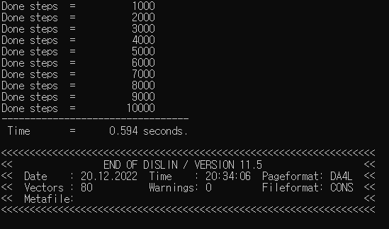
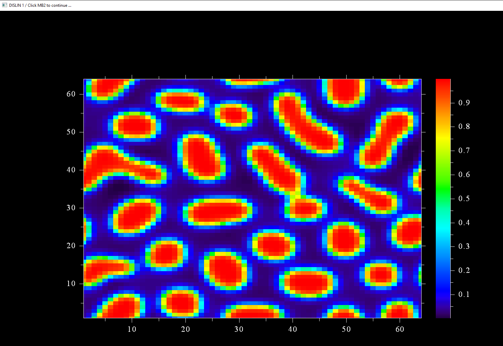
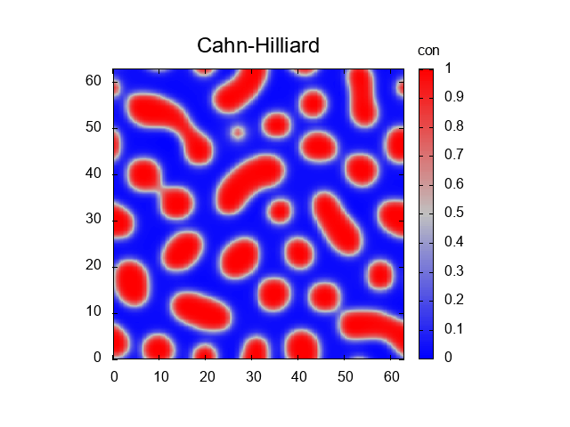

# **Fortran Phase-field Cahn-Hilliard Simulation**

This phase-field code is a 2D Fortran version of simulation of Cahn-Hilliard equation. This document presents the code in a self consistent manner. It is divided into these sections:

* Mathematical model
* Numerical method
* Fortran implementation
* Finite difference code
* gfortran vs intel for 256 x 256 simulation size
* Optimization

The first part describes the phase-field model and then it presents the numerical simulation method i.e. finite difference. The third section demonstrates: How to implement the code, and what are the expected outputs. The following explains the codes and compares two compilers. The final section demonstrates code optimization.

**Note:**
This is the Fortran version of [S. Bulent Biner](https://link.springer.com/book/10.1007/978-3-319-41196-5) **Programming Phase-field Modeling** **fd_ch_v1.m**, **section 4.4 Case Study-I**. It, however, uses **Dislin library** for the interactive display of the microstructure evolution. 


# **Mathematical Model**

### **Free energy function**

The total free energy **$F$** is given by

$$ F=\int\left[f\left(c\right)+\kappa\left(\nabla c\right)^2\right]dV$$

Where **$f(c)$** is the bulk chemical free energy density, **$c$** is the concentration as a conserved order parameter, $\kappa$ is gradient energy coefficient. 

The bulk free energy is 

$$  f(c) = Ac^2(1-c)^2  $$ 

$A$ is the barrier height.

### **Equation of evolution**

The evolution of conserved order parameter is linearly proportional to the variational derivative of free energy function . Mathematically it is

$$	\frac{{\partial c}}{\partial t}=\nabla\left[M\nabla\left(\frac{\delta F}{\delta c}\right)\right]$$

$$\frac{\partial c}{\partial t}=\nabla^2M  \frac{\delta F}{\delta c}$$

**$M$** is mobility

The variational derivative of **$F$** is

$$\frac{\delta F}{\delta c}=\left(\frac{\partial f}{\partial c}-\kappa \nabla^2 c\right)$$

where

$$ \frac{\partial f}{\partial c}= \mu $$ 

is chemical potential

The evolution equation now becomes

$$\frac{\partial c}{\partial t}=\nabla^2M\left(\frac{\partial f}{\partial c}-\kappa \nabla^2 c\right)$$

**The derivative of free energy function** is 

$$ \frac{\partial f}{\partial c}= A\left( 2c(1-c)^2 - 2c^2(1-c) \right) $$

# **Numerical method**

Since Cahn-Hilliard is a partial differential equation (PDE), various numerical methods are available for solving the equation. We use finite difference method here because of its simplicity.

Finite difference algorithms are simple and direct way to solve the phase field equations. They convert derivative to difference equation at each grid point to perform computation. 

There are various FD methods like backward difference, forward difference, centered difference and centered second difference methods. For our Laplace operator evaluation, we use five point stencils and is given by

$$\nabla^2 c_i = \frac{c_{i+1,j} + c_{i-1,j} + c_{i,j+1} + c_{i,j-1} -4c_{i,j}} {dxdy}$$

Graphically it is



The periodic boundary conditions are 

$$  c_{0,j} = c_{N_x,j}     $$ 

$$  c_{N_x+1,j} = c_{1,j}   $$

$$  c_{i,0} = c_{i,N_y}     $$ 

$$  c_{i,N_y+1} = c_{i,1}   $$

Using explicit Euler time marching scheme, the evolution equation becomes

$$\frac{c_{ij}^{n+1}-c_{ij}^n}{\Delta t}= \nabla^2M \cdot \left(\frac{\delta F}{\delta c}\right)^{n}$$

$$\left(\frac{\delta F}{\delta c}\right)^{n} = \frac{\partial f}{\partial {c_{ij}^{n}}}-\kappa \nabla^2 {c_{ij}^{n}}$$

after rearrangement

$$ {c_{ij}^{n+1} } = c_{ij}^n + \nabla^2M \Delta t \left( \frac{\partial f}{\partial {c_{ij}^{n}}}-\kappa \nabla^2 {c_{ij}^{n}} \right)$$

# **Fortran implementation**

## **Compilers**

To run Fortran code you may have a compiler installed. For this simulation we use gfortran and intel compilers.  

**gfortran compiler**

The following takes you to the installation of gfortran compiler.

https://www.linkedin.com/learning/introduction-to-fortran?trk=course_title&upsellOrderOrigin=default_guest_learning

**intel compiler**

https://www.intel.com/content/www/us/en/developer/tools/oneapi/hpc-toolkit-download.html

Two Fortran codes are there. The first one **fd_ch_dislin.f90** is using dislin library and second one **fd_ch.f90** without dislin.

## **with Dislin**
It is assumed that you have [dislin graphical library](https://dislin.de/) installed. Use **double precision module** for this code.

### **fd_ch_dislin.f90**

For **Linux OS** &mdash; with **gfortran** &mdash; to compile, enter
>gfortran fd_ch_dislin.f90 -o fd_ch_dislin -L/usr/local/dislin/ -I/usr/local/dislin/gf/real64 -ldislin_d

and to run, enter
>./fd_ch_dislin

and for **windows** &mdash; with **gfortran** and with **intel** &mdash; to compile, enter
>gfortran fd_ch_dislin.f90 -o fd_ch_dislin -Ic:\dislin\gf\real64  c:\dislin\dismg_d.a -luser32 -lgdi32  -lopengl32

>ifort fd_ch_dislin.f90 -Ic:\dislin_intel\ifc\real64 c:\dislin_intel\disifl_d.lib user32.lib gdi32.lib opengl32.lib

and to run, enter
>fd_ch_dislin

**fd_ch_dislin** is the name of file with .f90 extension. **fd** stands for **finite difference** and **ch** for **Cahn_Hilliard**. **dislin** refers to the use of dislin for this code.

* If the code runs successfully, it will produce following output. The first part prints the done steps and the computed time. The second part shows dislin plotting library information.



**The compute time may vary**
* The expected dislin plot of evolution is given below. The exact picture may vary since we are using subroutine `call random_numbers()`. 
* The figure is shown on the console and is not saved. 



## **without Dislin**

If dislin is not installed then use this code file.

### **fd_ch.f90**

For **Linux OS** &mdash; with **gfortran** &mdash; to compile, enter
>gfortran fd_ch.f90 -o fd_ch

and to run, enter
>./fd_ch

and for **windows** &mdash; with **gfortran** and with **intel** &mdash; to compile, enter
>gfortran fd_ch.f90 -o fd_ch

>ifort fd_ch.f90 

and to run, enter
>fd_ch

## <span style="color:red"> **Note:**</span>
In both codes, the ouput file **ch.dat** is created.

### **gnuplot commands**

You may use any graphical software to get the plot. For [gnuplot](http://www.gnuplot.info/download.html) use these commands:

```
cd 'D:\Fortran'
set view map
set size square
set xrange [*:*] noextend
set yrange [*:*] noextend
set key title 'con' at 75, 68
set title 'Cahn-Hilliard'font ',18'
set palette defined ( 0 'blue', 0.5 'grey', 1 'red' )
set pm3d map interpolate 9,9
splot 'ch.dat' matrix with pm3d notitle
```
The first line is the path where the file is located. In our case it is placed in `D` drive. The rest of the commands remain the same!

The output is



# **Finite difference code**

Here we briefly describe the code. 

## **fd_ch.f90** and  **fd_ch_dislin.f90**

The difference between two files is of these two statements

1. use Dislin
2. call qplclr ( con, Nx, Ny)

The Fortran program starts with the **program ch_test** and ends with **end program fd_ch_test**. The second statement **use Dislin** includes the Dislin library. **implicit none**  avoids any default behaviour of the compiler for data declaration.

```Fortran
program fd_ch_test
  use Dislin
  implicit none
```
### **Data declaration**

The simulation cell size is 64 $\times$ 64. The larger cell size increases the computational cost and if desired could be modified here. The grid spacing i.e., `dx` and `dy` is 1.0

```Fortran
  !-- simulation cell parameters

  integer ( kind = 4 ), parameter :: Nx = 64
  integer ( kind = 4 ), parameter :: Ny = 64
  integer ( kind = 4 ), parameter :: dx = 1
  integer ( kind = 4 ), parameter :: dy = 1
```
Here this part declares number of computed time steps and output frequency `nprint` to print the output done step every 1000 times steps. Other parameters are time increment `dt` and the `start` and `finish` to calculate the time of the code execution.

```Fortran
  !--- time integration parameters

  integer ( kind = 4 ), parameter :: nsteps = 10000
  integer ( kind = 4 ), parameter :: nprint = 1000
  integer ( kind = 4 )            :: tsteps
  real    ( kind = 8 ), parameter :: dt     = 0.01
  real    ( kind = 8 )            :: start, finish
```

This part is related to the microstructure parameters such as the initial concentration `c0`, the `gradient coefficient`, and the `mobility`.

```Fortran
  !--- material specific parameters

  real ( kind = 8 )   , parameter :: c0 = 0.4
  real ( kind = 8 )   , parameter :: mobility = 1.0
  real ( kind = 8 )   , parameter :: grad_coef = 0.5
```
We define the microstructure parameters in this declaration. `noise=0.02` is the thermal fluctuation, `A` is the height of the energy barrier. `i, j, jp, jm, ip, im` are the spatial discretization variables. `r` is for random number, 2 dimensional `con` variable stores the evolution of the concentration. `lap_con`, `dummy_con`, `lap_dummy` are 2 dimensional variable arrays for laplace evaluation. `dfdcon` is a 2 dimensional array to store the derivative of free energy.

```Fortran
  !--- microstructure parameters

  real ( kind = 8 )   , parameter :: noise = 0.02
  real ( kind = 8 )   , parameter :: A  = 1.0
  integer ( kind = 4 )            :: i, j, jp, jm, ip, im
  real ( kind = 8 )   , dimension ( Nx, Ny ) :: r, con, lap_con, dfdcon
  real ( kind = 8 )   , dimension ( Nx, Ny ) :: dummy_con, lap_dummy
```

This statement (intrinsic subroutine call) is used for the initial time of the program. The input argument `start` is the starting time of the code execution.

```Fortran
  call cpu_time ( start )
```
### **Initial microstructure**

The section performs the initial microsturucture. `call random_number ( r(i,j) )` is a subroutine to store the random numbers in a 2 dimensional variable `r`

```Fortran
  !--- initial microstructure

   do i = 1 , Nx
     do j = 1, Ny

        call random_number ( r (i,j) )

        con(i,j) = c0 + noise*( 0.5 - r(i,j) )

     end do
   end do
```
### **Evolution**

These statements start the evaluation at each time step and for all grid points. `time_loop` is the `name` of do construct. `row` and `column` are `names` for i and j `do loop construct` respectively.

```Fortran
  !--- start microstructure evolution

  time_loop: do tsteps = 1, nsteps

     row: do i = 1, Nx
        column: do j = 1, Ny
```

It evaluates the derivative of free energy at each grid point

```Fortran
           !--- free energy derivative

           dfdcon(i,j) = A*( 2.0*con(i,j)*( 1.0 - con(i,j) )**2 &
                - 2.0*con(i,j)**2*( 1.0 - con(i,j) ) )
```

This defines the boundary conditions and calculates Laplacian. Notice the use of `if` statement instead of `if then` construct. It reduces the code size.

```Fortran
           !--- laplace evaluation

           jp = j + 1
           jm = j - 1

           ip = i + 1
           im = i - 1

           if ( im == 0 ) im = Nx
           if ( ip == ( Nx + 1) ) ip = 1
           if ( jm == 0 ) jm = Ny
           if ( jp == ( Ny + 1) ) jp = 1

           lap_con(i,j)   = ( con(ip,j) + con(im,j) + con(i,jm) + con(i,jp) - &
                4.0*con(i,j) ) /( dx*dy )

           dummy_con(i,j) = dfdcon(i,j) - grad_coef*lap_con(i,j)

           lap_dummy(i,j) = ( dummy_con(ip,j) + dummy_con(im,j) + dummy_con(i,jm) &
                + dummy_con(i,jp) - 4.0*dummy_con(i,j) ) / ( dx*dy )
```

This implements explicit Euler finite difference 

```Fortran
           !--- time integration

           con(i,j) =  con(i,j) + dt*mobility*lap_dummy(i,j)
```

To main the order parameter in the range `0` and `1`, we use this part . The evaluation at each grid point finishes in this section. Note the use of statement labels for row and column do loop. It makes it easy to follow which do loop is ended here.

```Fortran
           !--- for small deviations

           if ( con(i,j) >= 0.99999 )  con(i,j) = 0.99999
           if ( con(i,j) < 0.00001 )   con(i,j) = 0.00001

        end do column
     end do row
```

This section prints the `done steps` on the screen.

```Fortran
    !--- print steps

     if ( mod( tsteps, nprint ) .eq. 0 ) print *, 'Done steps  =  ', tsteps
```

The microstructure evolution finishes here

```Fortran
     !--- end microstructure evolution

  end do time_loop
```

It takes the final time used for calculation, writes the value of `concentration` in the file **ch.dat** and closes the file.

```Fortran
  call cpu_time ( finish )

  !--- Open, write concentration on the file and closes it
 
  open ( 1, file = "ch.dat" )
  
  do i = 1, Nx
     write( 1, * ) ( con(i,j),j = 1, Ny )
  end do

  close( 1 )
```

This is the quick color dislin plot, and the last statement terminates the program. It is only in the file **fd_ch_dislin.f90**

```Fortran
  !--- quick Dislin color plot

  call qplclr ( con, Nx, Ny )

end program fd_ch_test
```

# **gfortran vs intel for 256 x 256 simulation size**

To compare the compute time we used the file **fd_ch.f90** and increased the simulation size to 256 $\times$ 256 i.e. `Nx = 256` and `Ny = 256`. The following statements were commented too:

```Fortran
  !--- write concentration on the file and closes it
  
  ! open ( 1, file = "ch.dat" )
  
  !do i = 1, Nx
  !   write( 1, * ) ( con(i,j),j = 1, Ny )
  !end do

  !close( 1 )
```

### **Computing platform**
The simulation was run on the Desktop system with these properties:

> Processor | 11th Gen Intel(R) Core™ i5-11500 @ 2.70GHz 2.71 GHz

> Installed RAM | 8.00 GB (7.83 GB usable)

> System type | 64-bit operating system, x64-based processor

1. The commands are
> gfortran fd_ch.f90 -o fd_ch

> ifort fd_ch.f90

|   Compilers   |   version    |    Compute time in seconds    |
| ------------- | -------------|-------------------------------| 
|   gfortran    |    12.1.0    |       12.891                  |  
|    intel      |    2021.6.0  |       8.543                   | 

# **Optimized code**

The codes are not optimized. Interchange the loops and use the do concurrent. Also use the compiler flags like -O3. 
