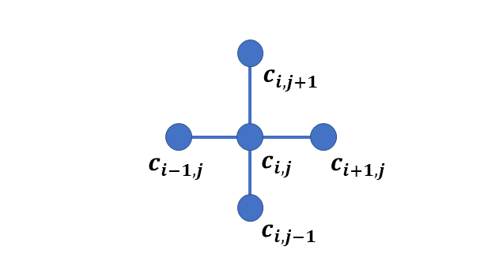
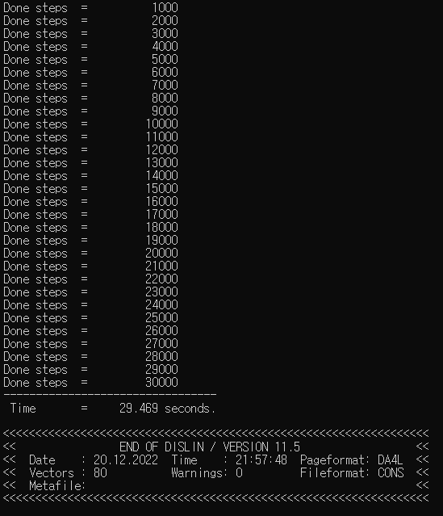
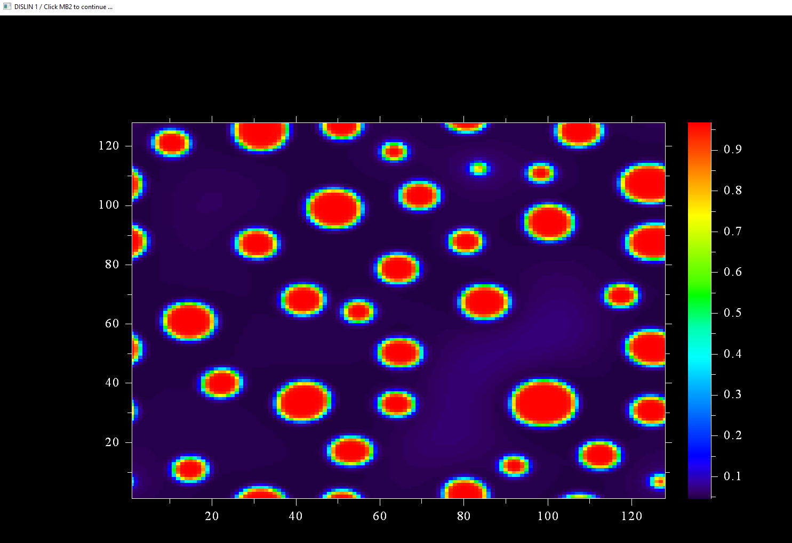
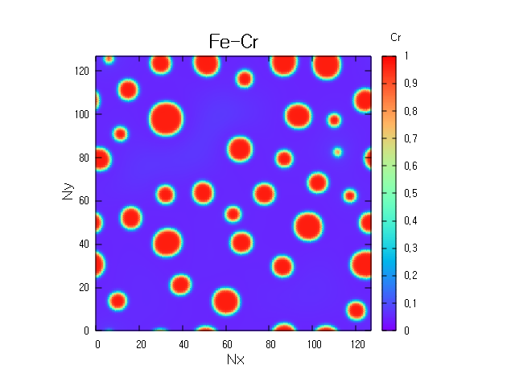

# **Fortran Phase-field Fe-Cr alloy Phase Separation Simulation**

This is a 2D Fortran code of Fe-Cr phase separation. Fe-Cr is one of the most studied alloy by the phase field method. Here we present its phase field simulation using model B &mdash; conserved order parameter .

This document presents the code in a self-consistent manner. It is divided into these sections

* Mathematical model
* Numerical method
* Fortran implementation
* Finite difference codes

The first part describes the phase-field model. Next part presents the numerical simulation method &mdash; finite difference. The third section demonstrates: How to implement the code, and what are the expected outputs? The following section explains the codes. 

# **Mathematical Model**

### **Free energy function**

The total free energy **$F$** is given by

$$ F=\int\left[f\left(c\right)+\kappa\left(\nabla c\right)^2\right]dV$$

Where **$f(c)$** is the bulk chemical free energy density, **$c$** is the $Cr$ concentration as a conserved order parameter, $\kappa$ is gradient energy coefficient. 

The bulk free energy is 

$$  f(c) = (1-c) G^0_{Fe} + c G^0_{Cr} + (20500-9.68T)c(1-c) + RT [c \ln c+ (1-c ) \ln (1-c) ]$$ 

where $G^0_{Fe}$ and $G^0_{Cr}$ are molar Gibb's free energies of pure **$Fe$** and **$Cr$** and are taken as 0. **$R$** is gas constant and **$T$** is temperature.

### **Equation of evolution**

The evolution of conserved order parameter is linearly proportional to the variational derivative of free energy function . Mathematically it is

$$	\frac{{\partial c}}{\partial t}=\nabla\left[M\nabla\left(\frac{\delta F}{\delta c}\right)\right]$$

$$\frac{\partial c}{\partial t}=\nabla^2M  \frac{\delta F}{\delta c}$$

**$M$** is mobility

The variational derivative of **$F$** is

$$\frac{\delta F}{\partial c}=\left(\frac{\partial f}{\partial c}-\kappa \nabla^2 c\right)$$

where 

$$ \frac{\partial f}{\partial c}= \mu  $$

is chemical potential

The evolution equation now becomes

$$\frac{\partial c}{\partial t}=\nabla^2M\left(\frac{\partial f}{\partial c}-\kappa \nabla^2 c\right)$$

The derivative of free energy function is 

$$ \frac{\partial f}{\partial c}= -c( 20500-9.68T)+(1-c)(20500.0-9.68T) + RT[log(c)-log(1-c) ] $$

# **Numerical method**

Since the model is a set of partial differential equations (PDE), various numerical methods can be used for solving the equations. We use finite difference methods here because of its simplicity.

Finite difference algorithms are simple and direct way to solve the phase field equations. They convert derivative to difference equation at each grid point to perform computation. 

There are various FD methods like backward difference, forward difference, centered difference and centered second difference methods. For our Laplace operator evaluation, we use five point stencils and is given by

$$\nabla^2 c = \frac{c_{i+1,j} + c_{i-1,j} + c_{i,j+1} + c_{i,j-1} -4c_{i,j}} {dxdy}$$

Graphically it is



Using explicit Euler time marching scheme, the evolution equation becomes

$$\frac{c_{ij}^{n+1}-c_{ij}^n}{\Delta t}= \nabla^2M \left(\frac{\delta F}{\delta c}\right)^{n+1}$$

$$\left(\frac{\delta F}{\delta c}\right)^{n+1} = \frac{\partial f}{\partial {c_{ij}^{n+1}}}-\kappa \nabla^2 {c_{ij}^{n+1}}$$

after rearrangement

$$ {c_{ij}^{n+1} } = c_{ij}^n + \nabla^2M  \Delta t \left( \frac{\partial f}{\partial {c_{ij}^{n+1}}}-\kappa \nabla^2 {c_{ij}^{n+1}} \right)$$

# **Fortran implementation**

## **Compilers**

To run Fortran code you may have a compiler installed. For this simulation we use gfortran and intel compilers.  

**gfortran compiler**

The following takes you to the installation of gfortran compiler.

https://www.linkedin.com/learning/introduction-to-fortran?trk=course_title&upsellOrderOrigin=default_guest_learning

**intel compiler**

https://www.intel.com/content/www/us/en/developer/tools/oneapi/hpc-toolkit-download.html

Two Fortran codes are there. The first one **fd_FeCr_dislin.f90** is using dislin library and second one **fd_FeCr.f90** without dislin.

## **With Dislin**
It is assumed that you have **dislin graphical library** installed. The link to the library is
https://dislin.de/

### **fd_FeCr_dislin.f90**
For **Linux OS** &mdash; with **gfortran** &mdash; to compile, enter
>gfortran fd_FeCr_dislin.f90 -o fd_FeCr_dislin -L/usr/local/dislin/ -I/usr/local/dislin/gf/real64 -ldislin_d

and to run, enter
>./fd_FeCr_dislin

and for **windows** &mdash; with **gfortran** and with **intel** &mdash; to compile, enter
>gfortran fd_FeCr_dislin.f90 -o fd_FeCr_dislin -Ic:\dislin\gf\real64  c:\dislin\dismg_d.a -luser32 -lgdi32  -lopengl32

>ifort fd_FeCr_dislin.f90 -Ic:\dislin_intel\ifc\real64 c:\dislin_intel\disifl_d.lib user32.lib gdi32.lib opengl32.lib

and to run, enter
>fd_FeCr_dislin

**fd_FeCr_dislin** is the name of file with .f90 extension. **fd** stands for **finite difference** and **FeCr** for **Fe  Cr**. **dislin** refers to the use of dislin for this code.

* If the code runs successfully, it will produce following output. The first part prints the done steps and the computed time. The second part shows dislin plotting library information.



**The compute time may vary**
* The expected dislin plot of evolution is given below.
The exact picture may vary since we are using subroutine random numbers. 



## **without Dislin**

If dislin is not installed then use this code file.

**fd_FeCr.f90**

For **Linux OS** &mdash; with **gfortran** &mdash; to compile, enter
>gfortran fd_FeCr.f90 -o fd_FeCr

and to run, enter
>./fd_FeCr

and for **windows** &mdash; with **gfortran** and with **intel** &mdash; to compile, enter
>gfortran fd_FeCr.f90 -o fd_FrCr

>ifort fd_FeCr.f90 

and to run, enter
>fd_FeCr

## **Note**
With dislin the figure is shown on the console and is not saved. In both codes, the ouput file **FeCr.dat** is created.

### **gnuplot commands**

You may use any graphical software to get the plot. In case, gnuplot is used we used the following commands.

```
cd 'D:\Fortran'
set view map
set size square
set xrange [*:*] noextend
set yrange [*:*] noextend
set key title 'Cr' at 147, 138
set title 'Fe-Cr'font ',18'
set xlabel ' Nx ' font ',14'
set ylabel ' Ny ' font ',14'
set palette defined ( 0 'blue', 0.5 'grey', 1 'red' )
set pm3d map interpolate 9,9
splot 'FeCr.dat' matrix with pm3d notitle
```
**Note:** The first line is the path where the file is located. In our case it is placed in **D** drive. The rest of the commands remain the same!

The output is



# **Finite difference codes**

Athough the code is written with related comments and declaration at each stage and is easy to follow, we will nonetheless briefly describe the code. 

## **fd_FeCr.f90** and  **fd_FeCr_dislin.f90**

The difference between two files is of these two statements

1. use Dislin
2. call qplclr ( cr, Nx, Ny)

The Fortran program starts with the **program fd_FeCr_test** and ends with **end program fd_FeCr_test**. The second statement **use Dislin** is used to include the Dislin library. **implicit none** is required to avoid any default behaviour of the compiler for data declaration.

```Fortran
program fd_FeCr_test
  use Dislin
  implicit none
```
### **Data declaration**

The simulation cell size is 128 $\times$ 128. The grid spacing i.e., `dx` and `dy` is 1.0. We declare a variable `dxdy` which stores the value of dx $\times$ dy value later in the code.

```Fortran
  !-- simulation cell parameters

  integer ( kind = 4 ), parameter :: Nx = 128
  integer ( kind = 4 ), parameter :: Ny = 128
  integer ( kind = 4 ), parameter :: dx = 1
  integer ( kind = 4 ), parameter :: dy = 1
  integer ( kind = 4 )            :: dxdy 
```
This section defines total number of computed steps, the output frequency and time increment `dt`. The variables `start` and `finish` are for the time of the code execution.

```Fortran
  !--- time integration parameters

  integer ( kind = 4 ), parameter :: nsteps = 30000
  integer ( kind = 4 ), parameter :: nprint = 1000
  integer ( kind = 4 )            :: tsteps
  real    ( kind = 8 ), parameter :: dt     = 0.01
  real    ( kind = 8 )            :: start, finish
```

This part is related to the microstructure parameters. It declares the initial concentration, the gradient coefficient and mobility. Temperature  is given in Kelvin and `gas_constant` is universal gas constant with value 8.314 J/mol/K. `RT` variable stores the evaluation of expression later in the code.

```Fortran
  !--- material specific parameters

  real ( kind = 8 )   , parameter :: c0 = 0.2
  real ( kind = 8 )   , parameter :: mobility = 0.50
  real ( kind = 8 )   , parameter :: grad_coef = 2.0
  real ( kind = 8 )   , parameter :: temperature = 535.0 
  real ( kind = 8 )   , parameter :: gas_constant = 8.314462
  real ( kind = 8 )               :: RT
```
We define the microstructure parameters here. `noise` is the thermal fluctuation. `i, j, jp, jm, ip, im` are the spatial discretization variables. `r` is for random number, 2 dimensional `cr` variable stores the evolution of the concentration. `lap_cr`, `dummy_cr`, `lap_dummy` are 2 dimensional variable arrays for laplace evaluation. `dfdcr` is a 2 dimensional array to store the derivative of free energy.

```Fortran
  !--- microstructure parameters

  real ( kind = 8 )   , parameter :: noise = 0.02
  real ( kind = 8 )   , parameter :: A  = 1.0
  real ( kind = 8 )   , dimension ( Nx, Ny ) :: r, cr, lap_cr
  real ( kind = 8 )   , dimension ( Nx, Ny ) :: dfdcr, dummy_cr, lap_dummy
  integer ( kind = 4 )            :: i, j, jp, jm, ip, im
```
This statement will open the `.dat` format file **FeCr.dat**. The output value of Cr concentration of the final time step is written in it.

```Fortran
  open ( 1, file = "FeCr.dat" )
```
This statement (intrinsic subroutine call) is used for the initial time of the program. The input argument `start` is the starting time of the code execution.

```Fortran
  call cpu_time ( start )
```
### **Initial microstructure**

The section implements the initial microsturucture. `call random_number ( r )` is a subroutine to store the random numbers in a 2 dimensional variable `r`

```Fortran
  !--- initial microstructure

  call random_number ( r )

  cr = c0 + noise*( 0.5 - r )
```
### **Evolution**

We evaluated the expressions `RT = gas_constant*temperature` and `dxdy` = `dx x dy` to avoid the same evaluation at each timestep. Next is the start of time discretization. `time_loop` is the statement label for the time do loop. We use concurrent programming technique with the statement `do concurrent ( i = 1 : Nx, j = 1 : Ny )` for spatial discretization. Note the use of statement label i.e., `spatial_loop`

```Fortran
  !--- start microstructure evolution

  RT = gas_constant*temperature
  dxdy = dx*dy

  time_loop: do tsteps = 1, nsteps

      spatial_loop: do concurrent ( i = 1 : Nx, j = 1 : Ny )
```

This calculates the derivative of free energy at each grid point. It is normalized with `RT`

```Fortran
        !--- free energy derivative

        dfdcr(i,j) = ( -cr(i,j)*( 20500.0 - 9.68*temperature ) + &
             & ( 1.0 - cr(i,j) )* ( 20500.0 - 9.68*temperature ) + &
             & ( log(cr(i,j)) - log(1.0 - cr(i,j)) ) *RT ) / RT
```

This calculates Laplacian. Notice the use of `if` statement instead of `if then` construct. It reduces the code size.

```Fortran
        !--- laplace evaluation

        jp = j + 1
        jm = j - 1

        ip = i + 1
        im = i - 1

        if ( im == 0 ) im = Nx
        if ( ip == ( Nx + 1) ) ip = 1
        if ( jm == 0 ) jm = Ny
        if ( jp == ( Ny + 1) ) jp = 1

        lap_cr(i,j) = ( cr(ip,j) + cr(im,j) + cr(i,jm) + &
             & cr(i,jp) - 4.0*cr(i,j) ) / ( dxdy )

        dummy_cr(i,j) = dfdcr(i,j) - grad_coef*lap_cr(i,j)

        lap_dummy(i,j) = (dummy_cr(ip,j) + dummy_cr(im,j) &
             & + dummy_cr(i,jm) + dummy_cr(i,jp) &
             & - 4.0*dummy_cr(i,j) ) / ( dxdy )
```

This section implements explicit Euler finite difference here

```Fortran
        !--- time integration

        cr(i,j) =  cr(i,j) + dt*mobility*lap_dummy(i,j)
```

This maintains the order parameters between `0` and `1`. The evaluation at each grid point finishes in this section. 

```Fortran
        !--- for small deviations

        if ( cr(i,j) >= 0.99999 ) cr(i,j) = 0.99999
        if ( cr(i,j) < 0.00001)  cr(i,j) = 0.00001

   end do spatial_loop
```

This section of the code prints the `done steps` on the screen.

```Fortran
    !--- print steps

     if ( mod( tsteps, nprint ) .eq. 0 ) print *, 'Done steps  =  ', tsteps
```

The microstructure evolution finishes here

```Fortran
     !--- end microstructure evolution

  end do temporal_loop
```

It takes the final time used for calculation, writes the value of `concentration` in the file `FeCr.dat` and closes the file.

```Fortran
  call cpu_time ( finish )

  !--- write concentration on the file and closes it

  do i = 1, Nx
     write( 1, * ) ( cr(i,j),j = 1, Ny )
  end do

  close( 1 )
```

This is the quick dislin plot in colors and the last statement terminates the program. Note it is only in the file **fd_FeCr_dislin.f90**

```Fortran
  !--- quick Dislin color plot

  call qplclr ( cr, Nx, Ny )

end program fd_FeCr_test
```
