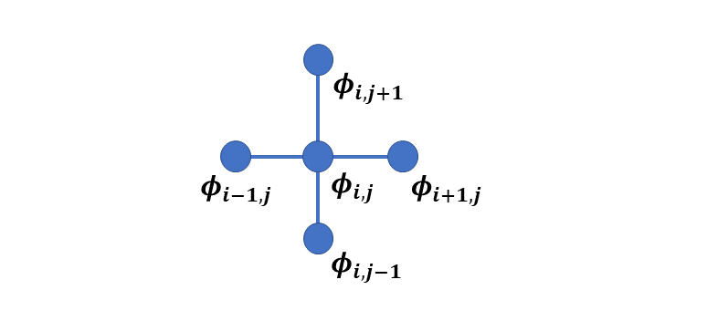
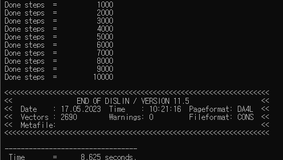
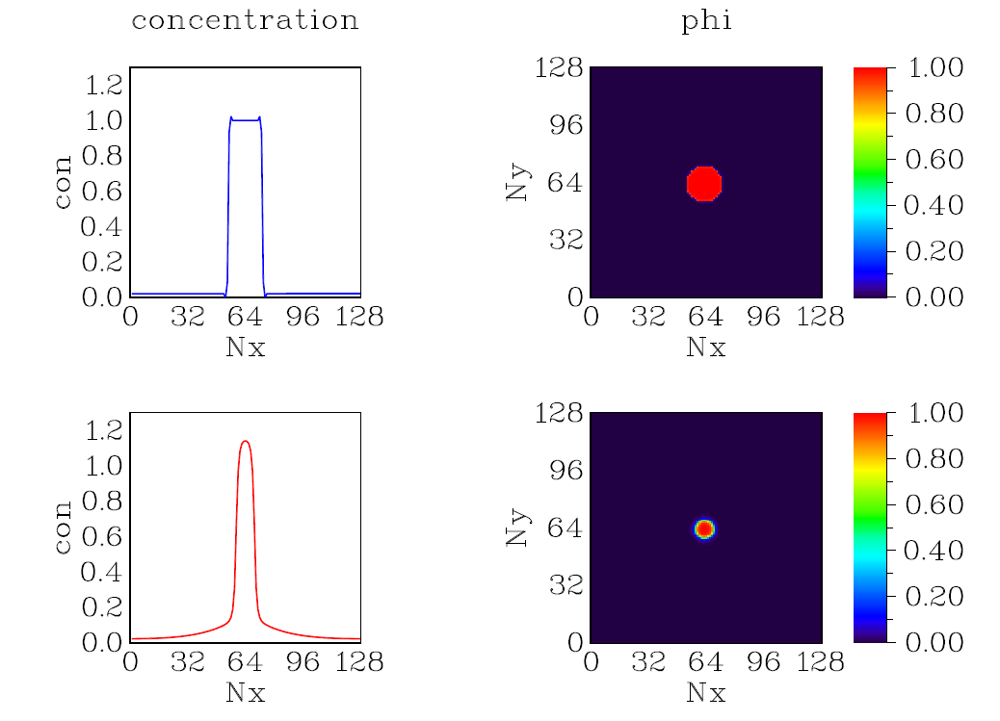
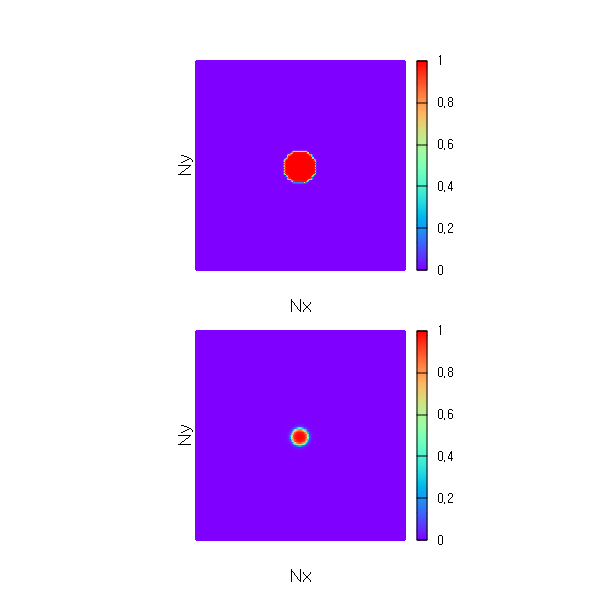

# **Fortran Phase-field CahnHilliard-AllenCahn Simulation**

This phase-field code is a 2D Fortran version of simulation of CahnHilliard-AllenCahn equations. This model contains both types of order parameters; conserved and non-conserved. It is used especially in the precipitate's evolution and in the dendrite formation etc. 

This document is separated into sections and written in a self-contained way.

* Mathematical model
* Numerical method
* Fortran implementation
* Finite difference code
* Optimization


The first part describes the phase-field model. Next part presents the numerical simulation method i.e. finite difference. The third section demonstrates: How to implement the code, and what are the expected outputs? The following section explains the codes. Finally, a few optimization strategies are given.

# **Mathematical Model**

### **Free energy functional**

The total free energy **$F$** is given by

$$ F=\int\left[f\left(c,\phi\right)+\kappa_c\left(\nabla c\right)^2 + \kappa_\phi\left(\nabla \phi\right)^2\right]dV$$

Where **$f(c,\phi)$** is the chemical free energy density, **$c$** is the conserved order parameter, **$\phi$** is the non-conserved order parameter, $\kappa_c$ is gradient energy coefficient of conserved order parameter and $\kappa_\phi$ is gradient energy coefficient of non-conserved order parameter. 

**The chemical free energy** is 

$$  f(c,\phi) = Ac^2(1-p(\phi)) + B (1-c)^2p(\phi) + Dq(\phi)  $$ 

where $p (\phi)$ is an interpolation function

 $$ p(\phi) = \phi^3 (10-15\phi+6\phi^2)   $$

and $q(\phi)$ is a double well potential function

$$  q(\phi) = \phi^2(1-\phi)^2  $$ 

$D$ is the height of the barrier.

### **Equations of evolution**

The evolution of conserved and non conserved order parameter is related to the variational derivative of free energy function. Mathematically

$$\frac{\partial c}{\partial t}=M\nabla^2  \frac{\delta F}{\delta c}$$

$$\frac{\partial \phi}{\partial t}=-L \frac{\delta F}{\delta \phi}$$

***M*** and ***L*** are mobilities for conserved and non-nonserved order parameters.

The variational derivatives of **$F$** are

$$\frac{\delta F}{\partial c}=\left(\frac{\partial f}{\partial c}-\kappa_c \nabla^2 c\right)$$

$$\frac{\delta F}{\partial \phi}=\left(\frac{\partial f}{\partial \phi}-\kappa_\phi \nabla^2 \phi\right)$$

The evolution equations now become

$$\frac{\partial c}{\partial t}=M\nabla^2\left(\frac{\partial f}{\partial c}-\kappa_c \nabla^2 c\right)$$

$$\frac{\partial \phi}{\partial t}=-L\left(\frac{\partial f}{\partial \phi}-\kappa_\phi \nabla^2 \phi\right)$$

**The derivative of free energy function** 

$$ \frac{\partial f}{\partial c}= 2Ac\left( 1-p(\phi)) -2B(1-c) p(\phi) \right) $$

$$ \frac{\partial f}{\partial \phi}= -Ac^2 p'(\phi) + B(1-c)^2p'(\phi) + 2D\phi(1-\phi)(1-2\phi)$$

where $p'$ is

$$      p' =   3\phi^2(10-15\phi+6\phi^2)   +\phi^3(12\phi-15)    $$ 

# **Numerical method**

Because the model is a partial differential equation (PDE), numerous numerical approaches for solving the equations are available. For the sake of simplicity, we use finite difference method here.

Finite difference algorithms are a straightforward method for solving phase field equations. They convert the derivative to the difference equation at each grid point.

FD techniques include backward difference, forward difference, centered difference, and centered second difference. We utilize five point stencils for our Laplace operator evaluation, which is given by

$$\nabla^2 \phi = \frac{\phi_{i+1,j} + \phi_{i-1,j} + \phi_{i,j+1} + \phi_{i,j-1} -4\phi_{i,j}} {dxdy}$$

**Graphically** it is



**The periodic boundary conditions** are 

$$  \phi_{0,j} = \phi_{N_x,j}     $$ 

$$  \phi_{N_x+1,j} = \phi_{1,j}   $$

$$  \phi_{i,0} = \phi_{i,N_y}     $$ 

$$  \phi_{i,N_y+1} = \phi_{i,1}   $$

Using explicit Euler time marching scheme, the evolution equation becomes

$$\frac{c^{n+1}-c^n}{\Delta t} = M\nabla^2 \left(\frac{\partial f}{\partial c}-\kappa_c \nabla^2 c\right) $$
$$\frac{\phi^{n+1}-\phi^n}{\Delta t}=-L\left(\frac{\partial f}{\partial \phi}-\kappa_\phi \nabla^2 \phi\right) $$

after rearrangement
$$c^{n+1}=c^n + M \Delta t \left(\frac{\partial f}{\partial \phi} - \kappa_c \nabla^2 \phi\right)$$
$$\phi^{n+1}=\phi^n - L \Delta t \left(\frac{\partial f}{\partial \phi} - \kappa_\phi \nabla^2 \phi\right)$$


# **Fortran implementation**

## **Compilers**

To run Fortran code you may have a compiler installed. For this simulation we use gfortran and intel compilers.  

**gfortran compiler**

The following takes you to the installation of gfortran compiler.

https://www.linkedin.com/learning/introduction-to-fortran?trk=course_title&upsellOrderOrigin=default_guest_learning

**intel compiler**

https://www.intel.com/content/www/us/en/developer/tools/oneapi/hpc-toolkit-download.html

Two Fortran codes are there. The first one **fd_ch_ac_dislin.f90** uses dislin library and second one **fd_ch_ac.f90** is without dislin.

## **with Dislin**

It is assumed that you have [dislin graphical library](https://dislin.de/) installed. Use **double precision module** for the code.

### **fd_ch_ac_dislin.f90**

* use the script given by Dislin. It is

> f90link -a -r8 fd_ch_ac_dislin

The command will compile and run the double precision (-r8) dislin module code.

* **Alternatively**

For **Linux OS** &mdash; with **gfortran** &mdash; to compile, enter
>gfortran fd_ch_ac_dislin.f90 -o fd_ch_ac_dislin -L/usr/local/dislin/ -I/usr/local/dislin/gf/real64 -ldislin_d

and to run, enter
>./fd_ch_ac_dislin

and for **windows** &mdash; with **gfortran** and with **intel** &mdash; to compile, enter
>gfortran fd_ch_ac_dislin.f90 -o fd_ch_ac_dislin -Ic:\dislin\gf\real64  c:\dislin\dismg_d.a -luser32 -lgdi32  -lopengl32

>ifort fd_ch_ac_dislin.f90 -Ic:\dislin_intel\ifc\real64 c:\dislin_intel\disifl_d.lib user32.lib gdi32.lib opengl32.lib

and to run, enter
>fd_ch_ac_dislin

**fd_ch_ac_dislin** is the name of file with .f90 extension. **fd** stands for **finite difference**, **ch** for **Cahn-Hilliard** and **ac** for **Allen-Cahn**. **dislin** refers to the use of dislin for this code.

* If the code runs successfully, it will produce following output. The first part prints the done steps and the computed time. The second part shows dislin plotting library information.



**The compute time may vary**
* The expected dislin plot is given below. The picture is displayed on the console and is not saved.



## **without Dislin**

If dislin is not installed, use this code file instead.

**fd_ch_ac.f90**

For **Linux OS** &mdash; with **gfortran** &mdash; to compile, enter
>gfortran fd_ch_ac.f90 -o fd_ch_ac

and to run, enter
>./fd_ch_ac

and for **windows** &mdash; with **gfortran** and with **intel** &mdash; to compile, enter
>gfortran fd_ch_ac.f90 -o fd_ch_ac

>ifort fd_ch_ac.f90 

and to run, enter
>fd_ch_ac

### **Note**
In both codes, two ouput files **phi_1.dat** and **phi_10000.dat** are created. The files store the value of phi for the first time step and the last time step.

### **gnuplot commands**

You may use any graphical software to get the plot. For [gnuplot](http://www.gnuplot.info/), use these commands:

```gnuplot
cd 'D:\Fortran'
set term qt 0 size 600,600
set multiplot layout 2,1 margins 0.1,0.9,0.1,0.9 spacing 0.10
set size ratio 1
set xrange [*:*] noextend
set yrange [*:*] noextend
set view map
set pm3d map interpolate 10,10
set palette rgbformulae 33,13,10
set cbrange[0:1]
unset key
unset xtics
unset ytics
set xlabel 'Nx' font ',14'
set ylabel 'Ny' font ',14'
unset border
# ---------------------------------------------------------
splot 'phi_1.dat' matrix with pm3d
# ---------------------------------------------------------
splot 'phi_10000.dat' matrix with pm3d
# ---------------------------------------------------------
unset multiplot
```
**Note:** The first line is the path where the file is located. In our case it is placed in **D** drive. The rest of the commands remain the same!

The output is



# **Finite difference code**

Here we briefly describe the code. All parameters are non dimensional.

## **fd_ch_ac.f90** and  **fd_ch_ac_dislin.f90**

The difference between two files is of these two statements

1. use Dislin statement
2. Dislin multiplot sections

The Fortran program starts with the **program fd_ch_ac_test** and ends with **end program fd_ch_ac_test**. The second statement **use Dislin** includes the Dislin library. **implicit none**  avoids any default behaviour of the compiler for data declaration.

```Fortran
program fd_ch_ac_test
  use Dislin
  implicit none
```
### **Data declaration**

The simulation cell size is 128 $\times$ 128. The larger cell size increases the computational cost and if desired could be modified here. The grid spacing i.e., **dx** and **dy** is 1.0

```Fortran
  !-- simulation cell parameters

  integer ( kind = 4 ), parameter :: Nx = 128
  integer ( kind = 4 ), parameter :: Ny = 128
  integer ( kind = 4 ), parameter :: dx = 1
  integer ( kind = 4 ), parameter :: dy = 1
```
This section declares the desired number of steps and the output frequency of the timesteps. The input arguments for start and end time calculations are declared here too.

```Fortran
  !--- time integration parameters

  integer ( kind = 4 ), parameter :: nsteps = 10000
  integer ( kind = 4 ), parameter :: nprint = 1000
  integer ( kind = 4 )            :: istep
  real    ( kind = 8 ), parameter :: dt     = 0.03
  real    ( kind = 8 )            :: start, finish
```

This part is related to the microstructure parameters. It defines the initial radius, the gradient coefficients and the mobilities.

```Fortran
  !--- material specific parameters

  real ( kind = 8 )   , parameter :: A = 1.0
  real ( kind = 8 )   , parameter :: B = 1.0
  real ( kind = 8 )   , parameter :: D = 1.0
  real ( kind = 8 )   , parameter :: mobility_con = 0.5
  real ( kind = 8 )   , parameter :: mobility_phi = 0.5
  real ( kind = 8 )   , parameter :: grad_coef_con = 1.5
  real ( kind = 8 )   , parameter :: grad_coef_phi = 1.5
  real ( kind = 8 )   , parameter :: radius = 10.0
```
`i, j, jp, jm, ip, im` are the spatial discretization variables. 2 dimensional `con` and `phi` variables store the conserved and non conserved order parameter. `dfdcon` and `dfdphi` are 2 dimensional arrays to store the derivatives of free energy wrt concentration and phi. `lap_phi`, and `dummy_phi` are 2 dimensional variable arrays for laplace evaluation. `con_profile`, `phi_profile`, and `x` are all arrays for the dislin plots.

```Fortran
   !--- microstructure parameters

  integer ( kind = 4 )                       :: i, j, jp, jm, ip, im
  real ( kind = 8 )   , dimension ( Nx, Ny ) :: con, phi, dfdcon, dfdphi
  real ( kind = 8 )   , dimension ( Nx, Ny ) :: lap_con, lap_phi
  real ( kind = 8 )   , dimension ( Nx, Ny ) :: dummy_con, lap_dummy, phi_dummy
  real ( kind = 8 )   , dimension ( Nx )     :: con_profile, phi_profile, x
```

This statement (intrinsic subroutine call) is used for the initial time of the program. The input argument `start` is the starting time of the code execution.

```Fortran
  call cpu_time ( start )
```
### **Initial microstructure**

The section introduces the initial microsturucture. The initial nucleus is defined with `phi = 1.0`. It represents a phase that is distinct with the second phase with `phi = 0.0`. The concentration inside the nucleus is taken as `1.0` while outside is `0.02`.

```Fortran
  do i = 1, Nx
     do j = 1, Ny


        if ( (i - Nx/2)*(i - Nx/2) + (j - Ny/2)*(j - Ny/2) < radius**2 ) then
           con(i,j) = 1.0
           phi(i,j) = 1.0
        else
           con(i,j) = 0.02
           phi(i,j) = 0.0
        endif


     end do
  end do
```

To get the multiplot, we need to call a few dislin routines here. These are must before the start of the evolution ( since that involves time steps). `call metafl ( 'cons' )` displays the output on the console. `call scrmod ( 'revers' )` makes the background white &mdash; the default is black.  `call disini ( )` initializes dislin.

```Fortran
  !---- setting initial dislin routines for multiplot 

  call metafl ( 'cons' )
  call scrmod ( 'revers' )
  call disini ( )
  ```
### **Evolution**

This part starts the evaluation at each time step for all grid points. `time_loop` is the statement label for the time do loop. 

```Fortran
  !--- start microstructure evolution

  time_loop: do istep = 1, nsteps


     do i = 1, Nx
        do j = 1, Ny
```

This calculates the derivatives of free energy wrt to concentration and phi at each grid point.

```Fortran
           !--- derivative wrt concentration and phi

           dfdcon(i,j) = 2*A*con(i,j)*(1-( phi(i,j)**3*( 10 - 15*phi(i,j) + &
                6*phi(i,j)**2 ) )) - 2*B*(1 - con(i,j))* &
                ( phi(i,j)**3*( 10 - 15*phi(i,j) + 6*phi(i,j)**2 ) )

           dfdphi(i,j) = -A*con(i,j)*con(i,j)*( 3*phi(i,j)**2*( 10 - &
                15*phi(i,j) + 6*phi(i,j)**2 ) + phi(i,j)**3* &
                ( 12*phi(i,j) - 15 )) + 2*B*(1 - con(i,j))* &
                (1 - con(i,j))*( 3*phi(i,j)**2*( 10 - 15*phi(i,j) + &
                6*phi(i,j)**2 ) + phi(i,j)**3*( 12*phi(i,j) - 15 )) + &
                2*D*phi(i,j)*(1 - phi(i,j))*(1 - 2*phi(i,j) )
```

This evaluates Laplacian. Note the use of `if` statement instead of `if then` construct. It reduces the code size.

```Fortran
           !--- laplace evaluation

           jp = j + 1
           jm = j - 1

           ip = i + 1
           im = i - 1

           if ( im == 0 ) im = Nx
           if ( ip == ( Nx + 1) ) ip = 1
           if ( jm == 0 ) jm = Ny
           if ( jp == ( Ny + 1) ) jp = 1


           !--- concentration

           lap_con(i,j)   = ( con(ip,j) + con(im,j) + con(i,jm) + &
                con(i,jp) - 4.0*con(i,j) ) / ( dx*dy )
           dummy_con(i,j) = dfdcon(i,j) - grad_coef_con*lap_con(i,j)

        end do
     end do

     do i = 1, Nx
        do j = 1, Ny


           jp = j + 1
           jm = j - 1

           ip = i + 1
           im = i - 1

           if ( im == 0 ) im = Nx
           if ( ip == ( Nx + 1) ) ip = 1
           if ( jm == 0 ) jm = Ny
           if ( jp == ( Ny + 1) ) jp = 1


           lap_dummy(i,j) = ( dummy_con(ip,j) + dummy_con(im,j) + &
                dummy_con(i,jm) + dummy_con(i,jp) - 4.0*dummy_con(i,j) ) &
                / ( dx*dy )


           !--- phi

           lap_phi(i,j) = ( phi(ip,j) + phi(im,j) + phi(i,jm) + &
                phi(i,jp) - 4.0*phi(i,j) ) / ( dx*dy )
           phi_dummy(i,j) = dfdphi(i,j) - grad_coef_phi*lap_phi(i,j)
```

The code implements explicit Euler finite difference here, and the evaluation at each grid point finishes here. 

```Fortran
           !--- time integration

           con(i,j) = con(i,j) + dt*mobility_con*lap_dummy(i,j)
           phi(i,j) = phi(i,j) - dt*mobility_phi*phi_dummy(i,j)


        end do
     end do
```

This maintains the order parameters between `0` and `1`. 

```Fortran
     !--- for small deviations

     do i = 1, Nx
        do j = 1, Ny

           if ( phi(i,j) >= 0.99999 )  phi(i,j) = 0.99999
           if ( phi(i,j) < 0.00001 )   phi(i,j) = 0.00001

        end do
     end do
```

This section of the code prints the performed number of steps on the screen.

```Fortran
    !--- print steps

    if ( mod( istep, nprint ) .eq. 0 )  print *, 'Done steps  =  ', istep
```

We call the dislin routines for the multiplot here. The mulitplot section involves two types of routine calls: One for the curve as shown in the left column of the figure above, and the second for the color plot shown in the right colomn. To get the curves, first we define the x array. Then the concentration profile value is attained by the array sectioning. 

`call complx ( )` sets the complex font. `call axspos (  )` defines the axis position for `x` and `y` axis, `call axlen (  )` defines the 2D axis lenghts. `call ax3len (  )` define the axis position and the axis length of the colored axis system. `call ticks( 0,'XY' )` removes the default ticks for x and y axis.  `call titlin (  )` calls the title the plot. It must be used together with `call title ()`. `call frame ( 3 )` defines the thickness of the frame. The default is 1. `call height ( 50 )` defines the height of the character. `call hname ( 50 )` defines the character height for axis name. `call name ( 'Nx', 'x' )` defines the name for x axis. `call labdig ( -1, 'x' )` makes x axis as integer. `call graf ()` draws the axis system for 2D curves.  `call thkcrv ( 3 )` makes the curve with 3 thickness. We use blue color for the initial curve and is set with `call color ( 'blue' )`. The routine `call curve ( x, con_profile, Nx )` draws the curve. To bring back the default color we use `call color ( 'fore' )`. The routine `call graf3 ( )` plots the 3D axis system with Z axis as a color bar. `call crvmat ( phi, Nx, Ny, 1, 1 )` plots color surface of the phi matrix. 1 represents the interpolation level. `call endgrf ( )` terminates the axis system. The dislin routine is finished with the routine `call disfin ( )`.

```Fortran
     !--- dislin multiplot

     do i = 1, Nx
        x(i)  = i
     end do


     con_profile = con( : , Nx/2 )
     phi_profile = phi( : , Nx/2 )


     if ( istep == 1 ) then

        call complx ( )
        call axspos ( 500, 800 )
        call axslen ( 600, 600 )
        call ticks( 0,'XY' )
        call titlin ( 'concentration', 4 )

        call frame ( 3 )                 
        call height ( 50 )
        call hname ( 50 )                
        call name ( 'Nx', 'x' )
        call name ( 'con', 'y' )
        
        call labdig ( -1, 'x' )  
        call graf ( 0.d0, 128.d0, 0.d0, 32.d0, 0.0d0, 1.3d0, 0.0d0, 0.2d0 )

        call thkcrv ( 3 )                
        call color ( 'blue' )
        call curve ( x, con_profile, Nx )
        call color ( 'fore' )
        call title
        call endgrf

     end if


     if ( istep == 1 ) then

        call autres ( Nx, Ny )
        call labdig ( 2, 'Z' )
        call labdig ( -1, 'y' ) 
        call ticks( 0,'XY' )
        call titlin ( 'phi', 4 )
        call complx ( )

        call axspos ( 1700, 800 )
        call ax3len ( 600, 600, 600 )
        call name ( 'Ny', 'y' )
        call graf3 ( 0.d0, 128.d0, 0.d0, 32.d0, 0.d0, 128.d0,&
             & 0.d0, 32.d0, 0.0d0, 1.0d0, 0.0d0, 0.2d0 )
        call crvmat ( phi, Nx, Ny, 1, 1 )
        call title ( )
        call endgrf ( )


     end if

     if ( istep == 10000 ) then
        call complx ( )
        call axspos ( 500, 1700 )
        call axslen ( 600, 600 )

        call frame ( 3 )                 
        call height ( 50 )
        call hname ( 50 )                
        call name ( 'Nx', 'x' )
        call name ( 'con', 'y' )
        call labdig ( -1, 'x' )
        call labdig ( 1, 'y' )
        call graf ( 0.d0, 128.d0, 0.d0, 32.d0, 0.0d0, 1.3d0, 0.d0, 0.2d0 )

        call thkcrv ( 3 )                 
        call color ( 'red' )
        call curve ( x, con_profile, Nx )
        call color ( 'fore' )
        call endgrf


     end if


     if ( istep == 10000 ) then

        call autres ( Nx, Ny )
        call labdig ( 2, 'Z' )
        call labdig ( -1, 'y' ) 
        call ticks( 0,'XY' )
        call complx ( )

        call axspos ( 1700, 1700 )
        call ax3len ( 600, 600, 600 )
        call name ( 'Ny', 'y' )
        call graf3 ( 0.d0, 128.d0, 0.d0, 32.d0, 0.d0, 128.d0,&
             & 0.d0, 32.d0, 0.0d0, 1.0d0, 0.0d0, 0.2d0 )
        call crvmat ( phi, Nx, Ny, 1, 1 )
        call endgrf

        call disfin ( )

     end if

```
It opens two files. First file for the first time step and the second file for the last time step. The value of `phi` is stored in these files and then they are closed.

```Fortran
     !--- write the values on files

     if ( istep == 1 ) then
        open ( 1, file = 'phi_1.dat' )
        do i = 1, Nx    
           write ( 1, * ) ( phi( i, j), j = 1, Ny )  
        end do
        close ( 1 )
     end if

     if ( istep == 10000 ) then      
        open ( 2, file = 'phi_10000.dat' )
        do i = 1, Nx            
           write ( 2, * ) ( phi( i, j), j = 1, Ny )
        end do
        close ( 2 )
     end if
```
The microstructure evolution finishes here. The final computed time is evaluated and printed and the last statement finishes the program.

```Fortran
     !--- end microstructure evolution
     
  end do time_loop


  call cpu_time ( finish )


  !--- prints computed time on the screen

  print*,'---------------------------------'
  print '("  Time       = ", f10.3," seconds." )', finish - start

  end program model_ch_ac_test
```

# **Optimization**

The codes are not optimized. You can interchange loops and use the do concurrent. Also, use the compiler flags like -O3.
